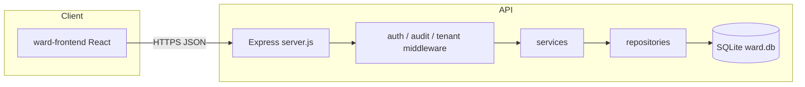

# General Ward — repository codemap

This file is part of the repo documentation/audit trail.
DO NOT DELETE `codemap/CODEMAP.md`. It is regenerated from `codemap/file-inventory.json` and is used for developer navigation and completeness checks.

Generated from `codemap/file-inventory.json` (run `node codemap/generate-codemap-index.mjs` first, then this script).

---

## Table of contents
- [Architecture overview](#architecture-overview)
- [Feature workflows](#feature-workflows)
- [Automation and scripts](#automation-and-scripts)
- [Data model (SQLite)](#data-model-sqlite)
- [Third-party inventory strategy](#third-party-inventory-strategy)
- [First-party file inventory](#first-party-file-inventory)
- [Completeness and known limitations](#completeness-and-known-limitations)

---

## Architecture overview

Monorepo with a **React (Vite) SPA** in `ward-frontend/` and an **Express + SQLite** API in `ward-backend/`. The root `package.json` orchestrates install/run.

### Component diagram

## Feature workflows

### Login and session

- UI: `ward-frontend/src/views/Login.jsx`, `ward-frontend/src/context/AuthContext.jsx`.
- API: `/api/auth/*`.

- Key implementation files:
  - `ward-backend/controllers/AuthController.js`
  - `ward-backend/services/AuthService.js`
  - `ward-backend/middleware/auth.js`
  - `ward-backend/repositories/AuthRepository.js`

### Dashboard (patient list / ward overview)

- UI: `ward-frontend/src/views/Dashboard.jsx`, `ward-frontend/src/utils/api.js`.
- API: `/api/patients`.

- Key implementation files:
  - `ward-backend/controllers/PatientController.js`
  - `ward-backend/services/PatientService.js`
  - `ward-backend/repositories/PatientRepository.js`

### 📑 Patient Treatment Report & Verification (Phase 11)

- UI: `ward-frontend/src/components/stats/DischargeSummaryTab.jsx`.
- API: `/api/reports`.

- Key implementation files:
  - `ward-backend/controllers/ReportController.js`
  - `ward-backend/services/ReportDataService.js`
  - `ward-backend/services/PDFReportService.js`
  - `ward-backend/services/ReportVerificationService.js`
  - `ward-backend/repositories/ReportRepository.js`

### Patient chart tabs (vitals, diet, sleep, scoring)

- UI: `ward-frontend/src/views/PatientDetail.jsx`, `ward-frontend/src/components/stats/VitalsTab.jsx`, `ward-frontend/src/components/stats/DietTab.jsx`, `ward-frontend/src/components/stats/SleepTab.jsx`.
- API: `/api/patients/:patientId/stats`, `/api/observations/*`.

- Key implementation files:
  - `ward-backend/routes/stats.js`
  - `ward-backend/routes/observations.js`
  - `ward-backend/services/ScoringService.js`

### Pharmacy Barcode & QR

- UI: `ward-frontend/src/components/BarcodeScanner.jsx`, `ward-frontend/src/views/Pharmacy.jsx`, `ward-frontend/src/components/stats/MedsTab.jsx`.
- API: `/api/pharmacy/scan/:code`, `/api/pharmacy/barcode/register`, `/api/pharmacy/stock/:stockId/qr`.

- Key implementation files:
  - `ward-backend/controllers/BarcodeController.js`
  - `ward-backend/services/BarcodeService.js`
  - `ward-backend/repositories/BarcodeRepository.js`
  - `ward-backend/utils/gs1Parser.js`

### Medications and MAR

- UI: `ward-frontend/src/components/stats/MedsTab.jsx`.
- API: `/api/patients/:patientId/medications`.

- Key implementation files:
  - `ward-backend/routes/medications.js`

### History timeline

- UI: `ward-frontend/src/components/stats/HistoryTab.jsx`.
- API: `/api/patients/:patientId/history`.

- Key implementation files:
  - `ward-backend/routes/history.js`

### Escalations

- UI: `ward-frontend/src/views/PatientDetail.jsx`.
- API: `/api/patients/:patientId/escalations`.

- Key implementation files:
  - `ward-backend/controllers/EscalationController.js`
  - `ward-backend/services/EscalationService.js`
  - `ward-backend/repositories/EscalationRepository.js`

### Tasks (ward board)

- UI: `ward-frontend/src/views/Tasks.jsx`.
- API: `/api/tasks`.

- Key implementation files:
  - `ward-backend/routes/tasks.js`
  - `ward-backend/services/TaskService.js`
  - `ward-backend/repositories/TaskRepository.js`
  - `ward-backend/middleware/tenant.js`

### Handover / patient notes

- UI: `ward-frontend/src/components/stats/HandoverNotesPanel.jsx`.
- API: `/api/patients/:patientId/notes`.

- Key implementation files:
  - `ward-backend/routes/patientNotes.js`
  - `ward-backend/services/HandoverNotesService.js`
  - `ward-backend/repositories/HandoverNotesRepository.js`

### Discharge / archive

- UI: `ward-frontend/src/components/stats/DischargeSummaryTab.jsx`.
- API: `/api/patients/archives`.

- Key implementation files:
  - `ward-backend/controllers/PatientController.js`
  - `ward-backend/services/PatientService.js`

## Automation and scripts

| Location | Command | Purpose |
| --- | --- | --- |
| Root | `npm run install-all` | Install backend + frontend deps. |
| Root | `npm start` | Run API and Vite dev server together (concurrently). |
| ward-backend | `npm test` | Jest + Supertest tests. |
| codemap | `node codemap/generate-codemap-index.mjs` | Regenerate `codemap/file-inventory.json`. |
| codemap | `node codemap/build-codemap-md.mjs` | Regenerate this codemap markdown. |

## Data model (SQLite)

Schema is defined/bootstrapped in `ward-backend/db.js` and uses `DailyStats` with a JSON/text `data` payload for multiple types.

### Data files on disk

- `ward-backend/scratch/ward.db` — runtime/DB artifact, not app source.
- `ward-backend/ward.db` — runtime/DB artifact, not app source.

## Third-party inventory strategy

`node_modules/**` is included in the inventory (`category: "thirdParty"`) and referenced via `packageName` in `codemap/file-inventory.json`. This markdown does not enumerate every third-party file.

## First-party file inventory

**211** first-party paths. Each entry provides a high-level reason; open the file for authoritative behavior.

### `.cursorrules`

First-party file (open to inspect exact behavior).

### `.github/workflows/ci.yml`

First-party file (open to inspect exact behavior).

### `.github/workflows/postgres-ci.yml`

First-party file (open to inspect exact behavior).

### `.gitignore`

First-party file (open to inspect exact behavior).

### `admin_cookies.txt`

First-party file (open to inspect exact behavior).

### `cookies.txt`

First-party file (open to inspect exact behavior).

### `cursorrules.md`

Documentation file that explains how to work with this repo/subsystem.

### `cursorrules/SESSION_INIT.md`

Documentation file that explains how to work with this repo/subsystem.

### `docker-compose.postgres.yml`

First-party file (open to inspect exact behavior).

### `docs/COMPLIANCE.md`

Documentation file that explains how to work with this repo/subsystem.

### `docs/plans/enterprise-hardening-detailed.md`

Documentation file that explains how to work with this repo/subsystem.

### `docs/plans/enterprise-hardening-PROGRESS.md`

Documentation file that explains how to work with this repo/subsystem.

### `docs/plans/launch-monitoring-contingency-detailed.md`

Documentation file that explains how to work with this repo/subsystem.

### `docs/plans/launch-monitoring-contingency-PROGRESS.md`

Documentation file that explains how to work with this repo/subsystem.

### `docs/plans/legal-gdpr-mapping.md`

Documentation file that explains how to work with this repo/subsystem.

### `docs/plans/patient-detail-ui-refresh-detailed.md`

Documentation file that explains how to work with this repo/subsystem.

### `docs/plans/patient-detail-ui-refresh-PROGRESS.md`

Documentation file that explains how to work with this repo/subsystem.

### `docs/plans/security-remediation-PROGRESS.md`

Documentation file that explains how to work with this repo/subsystem.

### `docs/plans/signup-payment-detailed.md`

Documentation file that explains how to work with this repo/subsystem.

### `docs/plans/signup-payment-PROGRESS.md`

Documentation file that explains how to work with this repo/subsystem.

### `docs/runbooks/core-workflow-manual-test.md`

Documentation file that explains how to work with this repo/subsystem.

### `docs/runbooks/multi-device-sync-validation.md`

Documentation file that explains how to work with this repo/subsystem.

### `docs/runbooks/postgres-cutover.md`

Documentation file that explains how to work with this repo/subsystem.

### `docs/runbooks/stress-test-gate.md`

Documentation file that explains how to work with this repo/subsystem.

### `docs/SECURITY_LOGGING.md`

Documentation file that explains how to work with this repo/subsystem.

### `doctor_cookies.txt`

First-party file (open to inspect exact behavior).

### `package-lock.json`

JSON configuration/state file used by the app or tooling.

### `package.json`

JSON configuration/state file used by the app or tooling.

### `README.md`

Documentation file that explains how to work with this repo/subsystem.

### `ward-backend/.env.example`

First-party file (open to inspect exact behavior).

### `ward-backend/check_lockouts.js`

First-party source code in the backend/frontend layer.

### `ward-backend/check_schema.js`

First-party source code in the backend/frontend layer.

### `ward-backend/check_users.js`

First-party source code in the backend/frontend layer.

### `ward-backend/CODENAV.md`

Documentation file that explains how to work with this repo/subsystem.

### `ward-backend/config.js`

First-party source code in the backend/frontend layer.

### `ward-backend/controllers/AuthController.js`

First-party source code in the backend/frontend layer.

### `ward-backend/controllers/BarcodeController.js`

First-party source code in the backend/frontend layer.

### `ward-backend/controllers/EscalationController.js`

First-party source code in the backend/frontend layer.

### `ward-backend/controllers/HandoverController.js`

First-party source code in the backend/frontend layer.

### `ward-backend/controllers/MedicationController.js`

First-party source code in the backend/frontend layer.

### `ward-backend/controllers/ObservationController.js`

First-party source code in the backend/frontend layer.

### `ward-backend/controllers/PatientController.js`

First-party source code in the backend/frontend layer.

### `ward-backend/controllers/PharmacyController.js`

First-party source code in the backend/frontend layer.

### `ward-backend/controllers/ReportController.js`

First-party source code in the backend/frontend layer.

### `ward-backend/controllers/TaskController.js`

First-party source code in the backend/frontend layer.

### `ward-backend/db.js`

First-party source code in the backend/frontend layer.

### `ward-backend/db/schema.js`

First-party source code in the backend/frontend layer.

### `ward-backend/dbAdapter/index.js`

First-party source code in the backend/frontend layer.

### `ward-backend/dbAdapter/postgresAdapter.js`

First-party source code in the backend/frontend layer.

### `ward-backend/dbAdapter/sqliteAdapter.js`

First-party source code in the backend/frontend layer.

### `ward-backend/dbAdapter/sqlPlaceholders.js`

First-party source code in the backend/frontend layer.

### `ward-backend/IMPLEMENTATION_STATE.json`

JSON configuration/state file used by the app or tooling.

### `ward-backend/legacy/README.md`

Documentation file that explains how to work with this repo/subsystem.

### `ward-backend/legacy/routes/auth.js`

First-party source code in the backend/frontend layer.

### `ward-backend/legacy/routes/patients.js`

First-party source code in the backend/frontend layer.

### `ward-backend/middleware/audit.js`

First-party source code in the backend/frontend layer.

### `ward-backend/middleware/auth.js`

First-party source code in the backend/frontend layer.

### `ward-backend/middleware/csrf.js`

First-party source code in the backend/frontend layer.

### `ward-backend/middleware/error.js`

First-party source code in the backend/frontend layer.

### `ward-backend/middleware/rbac.js`

First-party source code in the backend/frontend layer.

### `ward-backend/middleware/requestLogger.js`

First-party source code in the backend/frontend layer.

### `ward-backend/middleware/tenant.js`

First-party source code in the backend/frontend layer.

### `ward-backend/migratePostgres.js`

First-party source code in the backend/frontend layer.

### `ward-backend/package-lock.json`

JSON configuration/state file used by the app or tooling.

### `ward-backend/package.json`

JSON configuration/state file used by the app or tooling.

### `ward-backend/postgres-migrations/migrations/001_create_schema_migrations.sql`

First-party file (open to inspect exact behavior).

### `ward-backend/postgres-migrations/migrations/002_create_application_schema.sql`

First-party file (open to inspect exact behavior).

### `ward-backend/postgres-migrations/migrations/003_hospital_archives.sql`

First-party file (open to inspect exact behavior).

### `ward-backend/postgres-migrations/migrations/004_pharmacy_v2.sql`

First-party file (open to inspect exact behavior).

### `ward-backend/postgres-migrations/migrations/005_pharmacy_batches.sql`

First-party file (open to inspect exact behavior).

### `ward-backend/postgres-migrations/migrations/006_purchase_orders.sql`

First-party file (open to inspect exact behavior).

### `ward-backend/postgres-migrations/migrations/007_waste_records.sql`

First-party file (open to inspect exact behavior).

### `ward-backend/postgres-migrations/migrations/008_user_uniqueness.sql`

First-party file (open to inspect exact behavior).

### `ward-backend/postgres-migrations/planMigrations.js`

First-party source code in the backend/frontend layer.

### `ward-backend/postgres.js`

First-party source code in the backend/frontend layer.

### `ward-backend/repositories/AuthLockoutRepository.js`

First-party source code in the backend/frontend layer.

### `ward-backend/repositories/AuthRepository.js`

First-party source code in the backend/frontend layer.

### `ward-backend/repositories/BarcodeRepository.js`

First-party source code in the backend/frontend layer.

### `ward-backend/repositories/ClinicalChangeLogRepository.js`

First-party source code in the backend/frontend layer.

### `ward-backend/repositories/EscalationRepository.js`

First-party source code in the backend/frontend layer.

### `ward-backend/repositories/HandoverNotesRepository.js`

First-party source code in the backend/frontend layer.

### `ward-backend/repositories/MedicationRepository.js`

First-party source code in the backend/frontend layer.

### `ward-backend/repositories/ObservationRepository.js`

First-party source code in the backend/frontend layer.

### `ward-backend/repositories/PatientRepository.js`

First-party source code in the backend/frontend layer.

### `ward-backend/repositories/pharmacy/BatchRepository.js`

First-party source code in the backend/frontend layer.

### `ward-backend/repositories/pharmacy/StockRepository.js`

First-party source code in the backend/frontend layer.

### `ward-backend/repositories/pharmacy/TransactionRepository.js`

First-party source code in the backend/frontend layer.

### `ward-backend/repositories/PurchaseOrderRepository.js`

First-party source code in the backend/frontend layer.

### `ward-backend/repositories/ReportRepository.js`

First-party source code in the backend/frontend layer.

### `ward-backend/repositories/TaskRepository.js`

First-party source code in the backend/frontend layer.

### `ward-backend/repositories/WasteRepository.js`

First-party source code in the backend/frontend layer.

### `ward-backend/routes/adminAudit.js`

First-party source code in the backend/frontend layer.

### `ward-backend/routes/escalations.js`

First-party source code in the backend/frontend layer.

### `ward-backend/routes/reports.js`

First-party source code in the backend/frontend layer.

### `ward-backend/schema.sql`

First-party file (open to inspect exact behavior).

### `ward-backend/scratch/seed_pharmacy.js`

First-party source code in the backend/frontend layer.

### `ward-backend/scratch/stress_test.js`

First-party source code in the backend/frontend layer.

### `ward-backend/scripts/compareSqlitePostgresCounts.js`

First-party source code in the backend/frontend layer.

### `ward-backend/seed.js`

First-party source code in the backend/frontend layer.

### `ward-backend/server.js`

First-party source code in the backend/frontend layer.

### `ward-backend/services/AuthService.js`

First-party source code in the backend/frontend layer.

### `ward-backend/services/BarcodeService.js`

First-party source code in the backend/frontend layer.

### `ward-backend/services/ClinicalAuditService.js`

First-party source code in the backend/frontend layer.

### `ward-backend/services/EscalationService.js`

First-party source code in the backend/frontend layer.

### `ward-backend/services/HandoverNotesService.js`

First-party source code in the backend/frontend layer.

### `ward-backend/services/MedicationService.js`

First-party source code in the backend/frontend layer.

### `ward-backend/services/MigratorService.js`

First-party source code in the backend/frontend layer.

### `ward-backend/services/ObservationService.js`

First-party source code in the backend/frontend layer.

### `ward-backend/services/PatientService.js`

First-party source code in the backend/frontend layer.

### `ward-backend/services/PDFReportService.js`

First-party source code in the backend/frontend layer.

### `ward-backend/services/pharmacy/BatchService.js`

First-party source code in the backend/frontend layer.

### `ward-backend/services/pharmacy/StockService.js`

First-party source code in the backend/frontend layer.

### `ward-backend/services/pharmacy/TransactionService.js`

First-party source code in the backend/frontend layer.

### `ward-backend/services/PharmacyAnalyticsService.js`

First-party source code in the backend/frontend layer.

### `ward-backend/services/PharmacyReorderService.js`

First-party source code in the backend/frontend layer.

### `ward-backend/services/ReportDataService.js`

First-party source code in the backend/frontend layer.

### `ward-backend/services/ReportVerificationService.js`

First-party source code in the backend/frontend layer.

### `ward-backend/services/ScoringService.js`

First-party source code in the backend/frontend layer.

### `ward-backend/services/TaskService.js`

First-party source code in the backend/frontend layer.

### `ward-backend/services/WasteService.js`

First-party source code in the backend/frontend layer.

### `ward-backend/stressEverything.js`

First-party source code in the backend/frontend layer.

### `ward-backend/test_gs1.js`

First-party source code in the backend/frontend layer.

### `ward-backend/test_output.log`

First-party file (open to inspect exact behavior).

### `ward-backend/tests/integration/adminAudit.test.js`

Integration test validating service/routes behavior (run via `npm test` in `ward-backend`).

### `ward-backend/tests/integration/audit.test.js`

Integration test validating service/routes behavior (run via `npm test` in `ward-backend`).

### `ward-backend/tests/integration/auth.test.js`

Integration test validating service/routes behavior (run via `npm test` in `ward-backend`).

### `ward-backend/tests/integration/authCookie.test.js`

Integration test validating service/routes behavior (run via `npm test` in `ward-backend`).

### `ward-backend/tests/integration/barcode.test.js`

Integration test validating service/routes behavior (run via `npm test` in `ward-backend`).

### `ward-backend/tests/integration/history.test.js`

Integration test validating service/routes behavior (run via `npm test` in `ward-backend`).

### `ward-backend/tests/integration/ingest.test.js`

Integration test validating service/routes behavior (run via `npm test` in `ward-backend`).

### `ward-backend/tests/integration/medications.test.js`

Integration test validating service/routes behavior (run via `npm test` in `ward-backend`).

### `ward-backend/tests/integration/notes.test.js`

Integration test validating service/routes behavior (run via `npm test` in `ward-backend`).

### `ward-backend/tests/integration/rbac.test.js`

Integration test validating service/routes behavior (run via `npm test` in `ward-backend`).

### `ward-backend/tests/integration/reorder.test.js`

Integration test validating service/routes behavior (run via `npm test` in `ward-backend`).

### `ward-backend/tests/integration/reports.test.js`

Integration test validating service/routes behavior (run via `npm test` in `ward-backend`).

### `ward-backend/tests/integration/stats.test.js`

Integration test validating service/routes behavior (run via `npm test` in `ward-backend`).

### `ward-backend/tests/integration/tasks.test.js`

Integration test validating service/routes behavior (run via `npm test` in `ward-backend`).

### `ward-backend/tests/integration/tenantIsolation.test.js`

Integration test validating service/routes behavior (run via `npm test` in `ward-backend`).

### `ward-backend/tests/integration/trends.test.js`

Integration test validating service/routes behavior (run via `npm test` in `ward-backend`).

### `ward-backend/tests/services/migratePostgres.test.js`

Unit test validating service/routes behavior (run via `npm test` in `ward-backend`).

### `ward-backend/tests/services/PatientService.test.js`

Unit test validating service/routes behavior (run via `npm test` in `ward-backend`).

### `ward-backend/tests/services/postgresSmoke.test.js`

Unit test validating service/routes behavior (run via `npm test` in `ward-backend`).

### `ward-backend/tests/services/scoring.test.js`

Unit test validating service/routes behavior (run via `npm test` in `ward-backend`).

### `ward-backend/tests/services/ScoringService.test.js`

Unit test validating service/routes behavior (run via `npm test` in `ward-backend`).

### `ward-backend/utils/gs1Parser.js`

First-party source code in the backend/frontend layer.

### `ward-backend/utils/logger.js`

First-party source code in the backend/frontend layer.

### `ward-backend/utils/validation.js`

First-party source code in the backend/frontend layer.

### `ward-backend/verify_pw.js`

First-party source code in the backend/frontend layer.

### `ward-frontend/.env.example`

First-party file (open to inspect exact behavior).

### `ward-frontend/.gitignore`

First-party file (open to inspect exact behavior).

### `ward-frontend/CODENAV.md`

Documentation file that explains how to work with this repo/subsystem.

### `ward-frontend/eslint.config.js`

First-party source code in the backend/frontend layer.

### `ward-frontend/index.html`

HTML entry/prototype for the SPA or legacy UI.

### `ward-frontend/package-lock.json`

JSON configuration/state file used by the app or tooling.

### `ward-frontend/package.json`

JSON configuration/state file used by the app or tooling.

### `ward-frontend/public/vite.svg`

SVG asset (icon/illustration).

### `ward-frontend/README.md`

Documentation file that explains how to work with this repo/subsystem.

### `ward-frontend/src/App.css`

Frontend styling (global/app styles).

### `ward-frontend/src/App.jsx`

First-party source code in the backend/frontend layer.

### `ward-frontend/src/assets/react.svg`

SVG asset (icon/illustration).

### `ward-frontend/src/components/BarcodeScanner.jsx`

First-party source code in the backend/frontend layer.

### `ward-frontend/src/components/Layout.jsx`

First-party source code in the backend/frontend layer.

### `ward-frontend/src/components/modals/DischargeModal.jsx`

First-party source code in the backend/frontend layer.

### `ward-frontend/src/components/modals/EditPatientModal.jsx`

First-party source code in the backend/frontend layer.

### `ward-frontend/src/components/modals/EscalateModal.jsx`

First-party source code in the backend/frontend layer.

### `ward-frontend/src/components/stats/DietTab.jsx`

First-party source code in the backend/frontend layer.

### `ward-frontend/src/components/stats/DischargeSummaryTab.jsx`

First-party source code in the backend/frontend layer.

### `ward-frontend/src/components/stats/HandoverNotesPanel.jsx`

First-party source code in the backend/frontend layer.

### `ward-frontend/src/components/stats/HistoryTab.jsx`

First-party source code in the backend/frontend layer.

### `ward-frontend/src/components/stats/MedsTab.jsx`

First-party source code in the backend/frontend layer.

### `ward-frontend/src/components/stats/SleepTab.jsx`

First-party source code in the backend/frontend layer.

### `ward-frontend/src/components/stats/VitalsTab.jsx`

First-party source code in the backend/frontend layer.

### `ward-frontend/src/components/ui/tabs.jsx`

First-party source code in the backend/frontend layer.

### `ward-frontend/src/context/AuthContext.jsx`

First-party source code in the backend/frontend layer.

### `ward-frontend/src/features/dashboard/components/AddPatientModal.jsx`

First-party source code in the backend/frontend layer.

### `ward-frontend/src/features/dashboard/components/DashboardAlerts.jsx`

First-party source code in the backend/frontend layer.

### `ward-frontend/src/features/dashboard/components/DashboardStats.jsx`

First-party source code in the backend/frontend layer.

### `ward-frontend/src/features/dashboard/components/PatientCard.jsx`

First-party source code in the backend/frontend layer.

### `ward-frontend/src/features/dashboard/components/PatientGrid.jsx`

First-party source code in the backend/frontend layer.

### `ward-frontend/src/features/dashboard/DashboardView.jsx`

First-party source code in the backend/frontend layer.

### `ward-frontend/src/features/pharmacy/components/AddBatchModal.jsx`

First-party source code in the backend/frontend layer.

### `ward-frontend/src/features/pharmacy/components/AddStockModal.jsx`

First-party source code in the backend/frontend layer.

### `ward-frontend/src/features/pharmacy/components/AuditLogSlideover.jsx`

First-party source code in the backend/frontend layer.

### `ward-frontend/src/features/pharmacy/components/InventoryTable.jsx`

First-party source code in the backend/frontend layer.

### `ward-frontend/src/features/pharmacy/components/ProcurementTab.jsx`

First-party source code in the backend/frontend layer.

### `ward-frontend/src/features/pharmacy/components/RegisterBarcodeModal.jsx`

First-party source code in the backend/frontend layer.

### `ward-frontend/src/features/pharmacy/components/StockStats.jsx`

First-party source code in the backend/frontend layer.

### `ward-frontend/src/features/pharmacy/components/WasteTab.jsx`

First-party source code in the backend/frontend layer.

### `ward-frontend/src/features/pharmacy/PharmacyView.jsx`

First-party source code in the backend/frontend layer.

### `ward-frontend/src/index.css`

Frontend styling (global/app styles).

### `ward-frontend/src/main.jsx`

First-party source code in the backend/frontend layer.

### `ward-frontend/src/test/setup.js`

First-party source code in the backend/frontend layer.

### `ward-frontend/src/utils/api.ts`

First-party file (open to inspect exact behavior).

### `ward-frontend/src/utils/patientDisplay.ts`

First-party file (open to inspect exact behavior).

### `ward-frontend/src/utils/queryKeys.ts`

First-party file (open to inspect exact behavior).

### `ward-frontend/src/views/AdminAudit.jsx`

First-party source code in the backend/frontend layer.

### `ward-frontend/src/views/close_divs.txt`

First-party file (open to inspect exact behavior).

### `ward-frontend/src/views/divs.txt`

First-party file (open to inspect exact behavior).

### `ward-frontend/src/views/HospitalArchiveDetail.jsx`

First-party source code in the backend/frontend layer.

### `ward-frontend/src/views/Login.jsx`

First-party source code in the backend/frontend layer.

### `ward-frontend/src/views/Login.test.jsx`

First-party source code in the backend/frontend layer.

### `ward-frontend/src/views/NotFound.jsx`

First-party source code in the backend/frontend layer.

### `ward-frontend/src/views/PatientDetail.jsx`

First-party source code in the backend/frontend layer.

### `ward-frontend/src/views/Pharmacy.jsx.bak`

First-party file (open to inspect exact behavior).

### `ward-frontend/src/views/Signup.jsx`

First-party source code in the backend/frontend layer.

### `ward-frontend/src/views/Tasks.jsx`

First-party source code in the backend/frontend layer.

### `ward-frontend/src/views/VerifyReport.jsx`

First-party source code in the backend/frontend layer.

### `ward-frontend/src/vite-env.d.ts`

First-party file (open to inspect exact behavior).

### `ward-frontend/tsconfig.json`

JSON configuration/state file used by the app or tooling.

### `ward-frontend/vite.config.js`

First-party source code in the backend/frontend layer.

### `ward-management.html`

HTML entry/prototype for the SPA or legacy UI.

## Completeness and known limitations

- Inventory counts: **firstParty 211**, **thirdParty 38175**, **data 2**, total 38388.
- `.git/` is skipped by the walker; the `codemap/` directory is skipped by default to avoid recursion.
- Descriptions are high-level; this codemap is meant to map responsibilities and entry points, not replace reading code.
