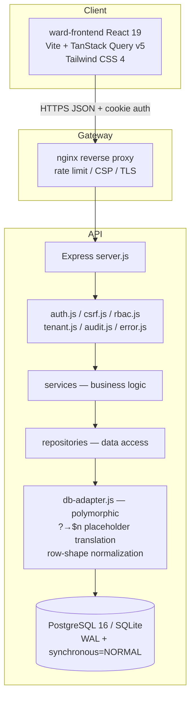

# General Ward — repository codemap

> Auto-generated from `codemap/file-inventory.json` with deep source analysis.
> Regenerate: `npm run codemap` (or `node codemap/generate-codemap-index.mjs && node codemap/build-codemap-md.mjs`).

---

## Table of contents
- [Architecture overview](#architecture-overview)
- [Feature workflows](#feature-workflows)
- [Data model (schema)](#data-model-schema)
- [Backend core](#backend-core)
- [Backend controllers](#backend-controllers)
- [Backend services](#backend-services)
- [Backend repositories](#backend-repositories)
- [Backend middleware](#backend-middleware)
- [Backend routes & utilities](#backend-routes--utilities)
- [Frontend views](#frontend-views)
- [Frontend features & components](#frontend-features--components)
- [Frontend context & utilities](#frontend-context--utilities)
- [Tests](#tests)
- [Scripts & automation](#scripts--automation)
- [Infrastructure & CI](#infrastructure--ci)
- [Documentation](#documentation)
- [First-party file inventory](#first-party-file-inventory)
- [Completeness and known limitations](#completeness-and-known-limitations)

---

## Architecture overview

Monorepo: **React 19 + Vite** SPA (`ward-frontend/`) and **Express 5 + PostgreSQL/SQLite** API (`ward-backend/`). Root `package.json` orchestrates install/run via `concurrently`.

**Key architectural rules:**
- **All repository code must use `db-adapter.js`** (not raw `db.js` calls) for cross-dialect compatibility.
- **Every query must scope by `tenantId`** — multi-tenant isolation enforced by middleware.
- **SQLite `withTransaction` uses a sequential global queue** (`BEGIN IMMEDIATE`) to prevent nested-transaction errors under concurrent writes.
- **Auth**: JWT (8h) in `ward_token` httpOnly cookie + `Authorization` header fallback + CSRF double-submit.
- **RBAC roles**: `doctor`, `nurse`, `pharmacist`, `admin` — permissions defined in `middleware/rbac.js`.

## Feature workflows

| Feature | UI entry | API route | Key backend files |
|---------|----------|-----------|-------------------|
| Login / session | `views/Login.jsx`, `context/AuthContext.jsx` | `/api/auth/*` | `controllers/AuthController.js`, `services/AuthService.js`, `middleware/auth.js` |
| Dashboard (patient list) | `features/dashboard/DashboardView.jsx` | `/api/patients` | `controllers/PatientController.js`, `services/PatientService.js`, `repositories/PatientRepository.js` |
| Patient detail (vitals, diet, sleep, scoring) | `views/PatientDetail.jsx` | `/api/patients/:id/stats`, `/api/observations/*` | `controllers/ObservationController.js`, `services/ScoringService.js`, `routes/stats.js` |
| Medications & MAR | `components/stats/MedsTab.jsx` | `/api/patients/:id/medications` | `controllers/MedicationController.js`, `services/MedicationService.js` |
| Pharmacy inventory | `features/pharmacy/PharmacyView.jsx` | `/api/pharmacy/*` | `controllers/PharmacyController.js`, `services/PharmacyService.js` |
| Pharmacy barcode scanning | `components/BarcodeScanner.jsx` | `/api/pharmacy/scan/:code` | `controllers/BarcodeController.js`, `services/BarcodeService.js`, `utils/gs1Parser.js` |
| Tasks (ward board) | `views/Tasks.jsx` | `/api/tasks` | `controllers/TaskController.js`, `services/TaskService.js`, `repositories/TaskRepository.js` |
| Escalations | `views/PatientDetail.jsx` | `/api/escalations` | `controllers/EscalationController.js`, `services/EscalationService.js` |
| Handover notes | `components/stats/HandoverNotesPanel.jsx` | `/api/patients/:id/notes` | `services/HandoverNotesService.js`, `repositories/HandoverNotesRepository.js` |
| Discharge & archive | `components/stats/DischargeSummaryTab.jsx` | `/api/patients/archives` | `controllers/PatientController.js`, `services/PatientService.js` |
| Patient treatment reports (PDF) | `views/VerifyReport.jsx` | `/api/reports` | `services/ReportDataService.js`, `services/PDFReportService.js` |
| Audit log (admin) | `views/AdminAudit.jsx` | `/api/admin/audit` | `routes/adminAudit.js` |
| Waste & spillage | `features/pharmacy/` | `/api/pharmacy/waste/*` | `services/WasteService.js`, `repositories/WasteRepository.js` |
| Purchase orders | `features/pharmacy/` | `/api/pharmacy/orders/*` | `services/PharmacyReorderService.js`, `repositories/PurchaseOrderRepository.js` |

## Data model (schema)

Source of truth: `ward-backend/schema.sql`. Postgres migrations: `ward-backend/postgres-migrations/migrations/`.

### `Users`

| Column | Type |
|--------|------|
| `id` | TEXT PRIMARY KEY |
| `name` | TEXT NOT NULL UNIQUE |
| `role` | TEXT CHECK(role IN ('doctor', 'nurse', 'pharmacist', 'admin')) NOT NULL |
| `tenantId` | TEXT |
| `passwordHash` | TEXT NOT NULL |

### `Tenants`

| Column | Type |
|--------|------|
| `id` | TEXT PRIMARY KEY |
| `name` | TEXT NOT NULL |

### `Patients`

| Column | Type |
|--------|------|
| `id` | TEXT PRIMARY KEY |
| `tenantId` | TEXT |
| `name` | TEXT NOT NULL |
| `mrn` | TEXT UNIQUE NOT NULL |
| `bedNumber` | TEXT NOT NULL |
| `dob` | TEXT NOT NULL |
| `diagnosis` | TEXT NOT NULL |
| `allergies` | TEXT |
| `careIntensity` | INTEGER CHECK(careIntensity IN (1, 2, 3, 4)) DEFAULT 1, |
| `status` | TEXT DEFAULT 'active', |
| `admittedAt` | DATETIME DEFAULT CURRENT_TIMESTAMP |

### `DailyStats`

| Column | Type |
|--------|------|
| `id` | TEXT PRIMARY KEY |
| `patientId` | TEXT NOT NULL |
| `tenantId` | TEXT |
| `type` | TEXT CHECK(type IN ('vital', 'symptom', 'diet', 'sleep', 'history')) NOT NULL |
| `data` | TEXT NOT NULL |
| `recordedBy` | TEXT NOT NULL |
| `timestamp` | DATETIME DEFAULT CURRENT_TIMESTAMP, |

### `Medications`

| Column | Type |
|--------|------|
| `id` | TEXT PRIMARY KEY |
| `patientId` | TEXT NOT NULL |
| `tenantId` | TEXT |
| `name` | TEXT NOT NULL |
| `dosage` | TEXT NOT NULL |
| `route` | TEXT NOT NULL |
| `frequency` | TEXT NOT NULL |
| `scheduledTimes` | TEXT |
| `prn` | BOOLEAN DEFAULT 0, |
| `startDate` | DATE NOT NULL |
| `prescribedBy` | TEXT NOT NULL |
| `status` | TEXT DEFAULT 'active', |
| `timestamp` | DATETIME DEFAULT CURRENT_TIMESTAMP, |

### `MedicationAdministrations`

| Column | Type |
|--------|------|
| `id` | TEXT PRIMARY KEY |
| `medicationId` | TEXT NOT NULL |
| `patientId` | TEXT NOT NULL |
| `tenantId` | TEXT |
| `status` | TEXT CHECK(status IN ('given', 'refused', 'missed')) NOT NULL |
| `notes` | TEXT |
| `administeredBy` | TEXT NOT NULL |
| `doseActuallyGiven` | TEXT |
| `reasonCode` | TEXT |
| `timestamp` | DATETIME DEFAULT CURRENT_TIMESTAMP, |

### `Escalations`

| Column | Type |
|--------|------|
| `id` | TEXT PRIMARY KEY |
| `patientId` | TEXT NOT NULL |
| `tenantId` | TEXT |
| `reason` | TEXT NOT NULL |
| `escalatedBy` | TEXT NOT NULL |
| `status` | TEXT CHECK(status IN ('pending', 'reviewed')) DEFAULT 'pending', |
| `timestamp` | DATETIME DEFAULT CURRENT_TIMESTAMP, |

### `DischargeSummaries`

| Column | Type |
|--------|------|
| `id` | TEXT PRIMARY KEY |
| `patientId` | TEXT NOT NULL |
| `tenantId` | TEXT |
| `reasonForAdmission` | TEXT NOT NULL |
| `duration` | TEXT NOT NULL |
| `medicationsDuringAdmission` | TEXT |
| `dischargeVitals` | TEXT NOT NULL |
| `dischargeRecommendations` | TEXT |
| `dischargedBy` | TEXT NOT NULL |
| `timestamp` | DATETIME DEFAULT CURRENT_TIMESTAMP, |

### `HospitalArchives`

| Column | Type |
|--------|------|
| `id` | TEXT PRIMARY KEY |
| `tenantId` | TEXT |
| `patientId` | TEXT NOT NULL |
| `dischargeSummaryId` | TEXT NOT NULL |
| `archivedAt` | TEXT NOT NULL |
| `dischargedBy` | TEXT NOT NULL |
| `patientName` | TEXT NOT NULL |
| `mrn` | TEXT NOT NULL |
| `bedNumber` | TEXT NOT NULL |
| `snapshotJson` | TEXT NOT NULL |

### `Tasks`

| Column | Type |
|--------|------|
| `id` | TEXT PRIMARY KEY |
| `patientId` | TEXT NOT NULL |
| `tenantId` | TEXT |
| `type` | TEXT NOT NULL CHECK(type IN ('vital', 'assessment', 'followup')) |
| `dueAt` | DATETIME NOT NULL |
| `status` | TEXT CHECK(status IN ('open', 'completed', 'cancelled')) DEFAULT 'open', |
| `assignee` | TEXT |
| `notes` | TEXT |
| `createdBy` | TEXT |
| `completedBy` | TEXT |
| `completedAt` | DATETIME |
| `timestamp` | DATETIME DEFAULT CURRENT_TIMESTAMP, |

### `HandoverNotes`

| Column | Type |
|--------|------|
| `id` | TEXT PRIMARY KEY |
| `patientId` | TEXT NOT NULL |
| `tenantId` | TEXT |
| `shift` | TEXT NOT NULL |
| `note` | TEXT NOT NULL |
| `tags` | TEXT |
| `createdBy` | TEXT NOT NULL |
| `timestamp` | DATETIME DEFAULT CURRENT_TIMESTAMP, |

### `AuditLogs`

| Column | Type |
|--------|------|
| `id` | TEXT PRIMARY KEY |
| `userId` | TEXT NOT NULL |
| `userRole` | TEXT NOT NULL |
| `tenantId` | TEXT |
| `action` | TEXT NOT NULL |
| `resource` | TEXT NOT NULL |
| `ipAddress` | TEXT NOT NULL |
| `statusCode` | INTEGER |
| `success` | INTEGER |
| `timestamp` | DATETIME DEFAULT CURRENT_TIMESTAMP |

### `ClinicalChangeLog`

| Column | Type |
|--------|------|
| `id` | TEXT PRIMARY KEY |
| `tenantId` | TEXT NOT NULL |
| `userId` | TEXT NOT NULL |
| `userRole` | TEXT NOT NULL |
| `entityType` | TEXT NOT NULL |
| `entityId` | TEXT NOT NULL |
| `action` | TEXT NOT NULL |
| `summary` | TEXT |
| `timestamp` | DATETIME DEFAULT CURRENT_TIMESTAMP |

### `IdempotencyKeys`

| Column | Type |
|--------|------|
| `idempotencyKey` | TEXT NOT NULL |
| `tenantId` | TEXT NOT NULL |
| `userId` | TEXT NOT NULL |
| `patientId` | TEXT NOT NULL |
| `endpoint` | TEXT NOT NULL |
| `status` | TEXT NOT NULL CHECK(status IN ('processing', 'completed')) DEFAULT 'processing', |
| `responseStatus` | INTEGER |
| `responseJson` | TEXT |
| `createdAt` | DATETIME DEFAULT CURRENT_TIMESTAMP, |
| `updatedAt` | DATETIME DEFAULT CURRENT_TIMESTAMP, |

### `PharmacyStock`

| Column | Type |
|--------|------|
| `id` | TEXT PRIMARY KEY |
| `tenantId` | TEXT NOT NULL |
| `name` | TEXT NOT NULL |
| `category` | TEXT |
| `costPerUnit` | REAL DEFAULT 0, |
| `expiryDate` | DATE |
| `manufacturer` | TEXT |
| `minThreshold` | INTEGER DEFAULT 10, |
| `barcode` | TEXT |
| `lastUpdated` | DATETIME DEFAULT CURRENT_TIMESTAMP, |

### `PharmacyTransactions`

| Column | Type |
|--------|------|
| `id` | TEXT PRIMARY KEY |
| `tenantId` | TEXT NOT NULL |
| `medicationId` | TEXT NOT NULL |
| `type` | TEXT CHECK(type IN ('restock', 'dispense', 'adjustment', 'waste')) NOT NULL |
| `userId` | TEXT NOT NULL |
| `userName` | TEXT NOT NULL |
| `notes` | TEXT |
| `timestamp` | DATETIME DEFAULT CURRENT_TIMESTAMP, |

### `PharmacyBatches`

| Column | Type |
|--------|------|
| `id` | TEXT PRIMARY KEY |
| `tenantId` | TEXT NOT NULL |
| `stockId` | TEXT NOT NULL |
| `batchNumber` | TEXT NOT NULL |
| `expiryDate` | DATE NOT NULL |
| `quantity` | INTEGER NOT NULL DEFAULT 0, |
| `costPerUnit` | REAL DEFAULT 0, |
| `manufacturer` | TEXT |
| `receivedDate` | DATE |
| `status` | TEXT DEFAULT 'active' CHECK(status IN ('active', 'expired', 'recalled', 'depleted')) |
| `barcode` | TEXT |
| `notes` | TEXT |
| `createdAt` | DATETIME DEFAULT CURRENT_TIMESTAMP, |
| `lastUpdated` | DATETIME DEFAULT CURRENT_TIMESTAMP, |

### `AuthLoginAttempts`

| Column | Type |
|--------|------|
| `username` | TEXT NOT NULL |
| `ipAddress` | TEXT NOT NULL |
| `attemptCount` | INTEGER NOT NULL |
| `firstAttemptAt` | DATETIME NOT NULL |
| `lockedUntil` | DATETIME |

### `PurchaseOrders`

| Column | Type |
|--------|------|
| `id` | TEXT PRIMARY KEY |
| `tenantId` | TEXT NOT NULL |
| `stockId` | TEXT NOT NULL |
| `quantity` | INTEGER NOT NULL |
| `status` | TEXT CHECK(status IN ('pending', 'ordered', 'received', 'cancelled')) DEFAULT 'pending', |
| `generatedAt` | DATETIME DEFAULT CURRENT_TIMESTAMP, |
| `orderedAt` | DATETIME |
| `receivedAt` | DATETIME |
| `notes` | TEXT |

### `WasteRecords`

| Column | Type |
|--------|------|
| `id` | TEXT PRIMARY KEY |
| `tenantId` | TEXT NOT NULL |
| `stockId` | TEXT NOT NULL |
| `batchId` | TEXT |
| `quantityWasted` | INTEGER NOT NULL CHECK(quantityWasted > 0) |
| `unit` | TEXT NOT NULL |
| `reasonCode` | TEXT NOT NULL CHECK(reasonCode IN ('EXPIRED','DAMAGED','CONTAMINATED','SPILL','OTHER')) |
| `reasonNotes` | TEXT |
| `status` | TEXT NOT NULL DEFAULT 'PENDING' CHECK(status IN ('PENDING','CONFIRMED','CANCELLED')) |
| `initiatedByUserId` | TEXT NOT NULL |
| `initiatedByUserName` | TEXT NOT NULL |
| `initiatedAt` | DATETIME DEFAULT CURRENT_TIMESTAMP, |
| `witnessUserId` | TEXT |
| `witnessUserName` | TEXT |
| `witnessedAt` | DATETIME |
| `pharmacyTransactionId` | TEXT |
| `createdAt` | DATETIME DEFAULT CURRENT_TIMESTAMP, |
| `updatedAt` | DATETIME DEFAULT CURRENT_TIMESTAMP, |

### `BarcodeRegistrations`

| Column | Type |
|--------|------|
| `tenantId` | TEXT NOT NULL |
| `targetType` | TEXT NOT NULL CHECK(targetType IN ('STOCK','BATCH')) |
| `barcode` | TEXT NOT NULL |
| `registeredAt` | TEXT NOT NULL DEFAULT (datetime('now')), |
| `notes` | TEXT |

### `PatientReports`

| Column | Type |
|--------|------|
| `tenantId` | TEXT NOT NULL |
| `patientId` | TEXT NOT NULL REFERENCES Patients(id) |
| `reportType` | TEXT NOT NULL DEFAULT 'FULL_TREATMENT' CHECK(reportType IN ('FULL_TREATMENT','DISCHARGE_SUMMARY')) |
| `generatedByUserId` | TEXT NOT NULL REFERENCES Users(id) |
| `generatedAt` | TEXT NOT NULL DEFAULT (datetime('now')), |

## Backend core

### `ward-backend/config.js`

_59 lines_

**Functions:**
- `normalizeNodeEnv(raw)`
- `validateNodeEnv(nodeEnv)`
- `isProdLike(nodeEnv)`
- `getJwtSecret()`
- `getCorsOrigins({ nodeEnv })`

### `ward-backend/db-adapter.js`

_119 lines_

**Functions:**
- `translatePlaceholders(sql)`
- `normalizeRows(result)`

### `ward-backend/db-postgres.js`

_76 lines_
- Exports: `pool`, `withTransaction`, `initPostgresDb`

**Functions:**
- `withTransaction(fn)`
- `initPostgresDb()`

### `ward-backend/db.js`

_74 lines_
- Exports: `db`, `initDb`, `withTransaction`, `runAsync`, `getAsync`, `allAsync`

**Functions:**
- `withTransaction(work)`
- `runAsync(sql, params = [])`
- `getAsync(sql, params = [])`
- `allAsync(sql, params = [])`
- `initDb()`

### `ward-backend/server.js`

_183 lines_
- Exports: `app`

**Functions:**
- `getCorsMiddleware()`
- `startServer()`

## Backend controllers

### `ward-backend/controllers/AuthController.js`

Express route controller handling HTTP requests for Auth endpoints.

_122 lines_
- Express middleware: processes `(req, res, next)`.

**Routes:**
- `POST /login`
- `POST /signup`
- `POST /logout`
- `GET /me`

**Functions:**
- `getCookieOptions()`
- `getClientIp(req)`
- `publicUserAndCsrf(userPayload)`

### `ward-backend/controllers/BarcodeController.js`

Express route controller handling HTTP requests for Barcode endpoints.

_58 lines_
- Express middleware: processes `(req, res, next)`.

**Routes:**
- `GET /scan/:barcode`
- `POST /register`
- `GET /qr/:id`
- `GET /history/:barcode`

### `ward-backend/controllers/EscalationController.js`

Express route controller handling HTTP requests for Escalation endpoints.

_45 lines_

**Routes:**
- `POST /`
- `GET /all`
- `POST /:escalationId/review`

### `ward-backend/controllers/HandoverController.js`

Express route controller handling HTTP requests for Handover endpoints.

_55 lines_

**Routes:**
- `POST /notes`
- `GET /notes`
- `POST /tasks`
- `GET /tasks`

### `ward-backend/controllers/MedicationController.js`

Express route controller handling HTTP requests for Medication endpoints.

_129 lines_

**Routes:**
- `GET /`
- `POST /`
- `GET /administrations`
- `POST /:medId/administer`
- `PUT /administrations/:adminId`
- `DELETE /administrations/:adminId`
- `PUT /:medId`

**Functions:**
- `validateMedicationPayload(payload)`
- `validateAdministrationPayload(payload)`

### `ward-backend/controllers/ObservationController.js`

Express route controller handling HTTP requests for Observation endpoints.

_105 lines_

**Routes:**
- `POST /`
- `GET /`
- `GET /ews/latest`
- `GET /trends`
- `POST /ingest`

### `ward-backend/controllers/PatientController.js`

Express route controller handling HTTP requests for Patient endpoints.

_147 lines_

**Routes:**
- `USE /:patientId/medications`
- `USE /:patientId/history`
- `USE /:patientId/stats`
- `USE /:patientId/escalations`
- `USE /:patientId`
- `POST /`
- `GET /`
- `GET /archives`
- `GET /archives/:archiveId`
- `GET /:id`
- `GET /:id/discharge-summary`
- `PUT /:id`
- `POST /:id/discharge`

### `ward-backend/controllers/PharmacyController.js`

Express route controller handling HTTP requests for Pharmacy endpoints.

_339 lines_

**Routes:**
- `GET /inventory`
- `GET /history`
- `POST /inventory`
- `PATCH /inventory/:id`
- `DELETE /inventory/:id`
- `GET /inventory/:stockId/batches`
- `POST /inventory/:stockId/batches`
- `POST /batches/:batchId/recall`
- `GET /recall-trace/:batchId`
- `GET /batches/search`
- `POST /inventory/:stockId/sync`
- `GET /analytics/consumption`
- `GET /analytics/financial`
- `GET /analytics/replenishment`
- `GET /orders`
- `PATCH /orders/:id/status`
- `POST /orders/check-all`
- `POST /waste`
- `GET /waste/pending`
- `GET /waste`
- … and 2 more

**Functions:**
- `validateBatchPayload(body)`

### `ward-backend/controllers/ReportController.js`

Express route controller handling HTTP requests for Report endpoints.

_86 lines_
- **class ReportController** — `generateReport(req, res)`

### `ward-backend/controllers/TaskController.js`

Express route controller handling HTTP requests for Task endpoints.

_35 lines_

**Routes:**
- `GET /my`
- `PUT /:taskId/complete`

### `ward-backend/controllers/UserController.js`

Express route controller handling HTTP requests for User endpoints.

_64 lines_

**Routes:**
- `GET /`
- `POST /`
- `DELETE /:id`

## Backend services

### `ward-backend/services/AuthService.js`

Business-logic service layer for Auth operations.

_111 lines_
- **class AuthService** — `authenticateUser(username, password)`

### `ward-backend/services/BarcodeService.js`

Business-logic service layer for Barcode operations.

_90 lines_
- **class BarcodeService** — `resolveScan(tenantId, rawBarcode)`

### `ward-backend/services/ClinicalAuditService.js`

Business-logic service layer for ClinicalAudit operations.

_114 lines_
- **class ClinicalAuditService**

### `ward-backend/services/EscalationService.js`

Business-logic service layer for Escalation operations.

_36 lines_
- **class EscalationService** — `createEscalation(patientId, reason, escalatedBy, tenantId)`

### `ward-backend/services/HandoverNotesService.js`

Business-logic service layer for HandoverNotes operations.

_51 lines_
- **class HandoverNotesService** — `createNote(patientId, payload, createdBy, tenantId)`

### `ward-backend/services/MedicationService.js`

Business-logic service layer for Medication operations.

_182 lines_
- **class MedicationService** — `getMedications(patientId, tenantId)`

### `ward-backend/services/MigratorService.js`

Business-logic service layer for Migrator operations.

_58 lines_
- **class MigratorService** — `runMigrations()`

### `ward-backend/services/ObservationService.js`

Business-logic service layer for Observation operations.

_203 lines_
- **class ObservationService** — `_parseTimestamp(raw)`

### `ward-backend/services/PatientService.js`

Business-logic service layer for Patient operations.

_117 lines_
- **class PatientService** — `createPatient(data)`

### `ward-backend/services/PDFReportService.js`

Business-logic service layer for PDFReport operations.

_250 lines_
- **class PDFReportService** — `generateTreatmentReport(data, reportId, hash)`

### `ward-backend/services/pharmacy/BatchService.js`

Business-logic service layer for Batch operations.

_164 lines_
- **class BatchService** — `addBatch(stockId, tenantId, batchData, user)`

### `ward-backend/services/pharmacy/StockService.js`

Business-logic service layer for Stock operations.

_107 lines_
- **class StockService** — `getInventory(tenantId)`

### `ward-backend/services/pharmacy/TransactionService.js`

Business-logic service layer for Transaction operations.

_116 lines_
- **class TransactionService**

### `ward-backend/services/PharmacyAnalyticsService.js`

Business-logic service layer for PharmacyAnalytics operations.

_136 lines_
- **class PharmacyAnalyticsService**

### `ward-backend/services/PharmacyReorderService.js`

Business-logic service layer for PharmacyReorder operations.

_79 lines_
- **class PharmacyReorderService** — `triggerReorderCheck(tenantId, stockId)`

### `ward-backend/services/ReportDataService.js`

Business-logic service layer for ReportData operations.

_113 lines_
- **class ReportDataService** — `aggregatePatientData(patientId, tenantId)`

### `ward-backend/services/ReportVerificationService.js`

Business-logic service layer for ReportVerification operations.

_57 lines_
- **class ReportVerificationService** — `verifyReport(scannedPayload, tenantId)`

### `ward-backend/services/ScoringService.js`

ScoringService.js

Implements clinical scoring protocols for patient risk assessment.
Standard: NEWS2 (National Early Warning Score 2)

_167 lines_
- **class ScoringService**

### `ward-backend/services/TaskService.js`

Business-logic service layer for Task operations.

_65 lines_
- **class TaskService** — `createTask(patientId, payload, createdBy, tenantId)`

### `ward-backend/services/WasteService.js`

Business-logic service layer for Waste operations.

_243 lines_
- **class WasteService**

## Backend repositories

### `ward-backend/repositories/AuthLockoutRepository.js`

Data-access repository for AuthLockout persistence.

_86 lines_
- **class AuthLockoutRepository**

### `ward-backend/repositories/AuthRepository.js`

Data-access repository for Auth persistence.

_62 lines_
- **class AuthRepository** — `findUserByName(username)`

### `ward-backend/repositories/BarcodeRepository.js`

Data-access repository for Barcode persistence.

_90 lines_
- **class BarcodeRepository** — `resolveByBarcode(tenantId, barcode)`

### `ward-backend/repositories/ClinicalChangeLogRepository.js`

Data-access repository for ClinicalChangeLog persistence.

_35 lines_
- Exports: `insert`

**Functions:**
- `insert(row)`

### `ward-backend/repositories/DpdpaRepository.js`

Data-access repository for Dpdpa persistence.

_127 lines_
- **class DpdpaRepository**

### `ward-backend/repositories/EscalationRepository.js`

Data-access repository for Escalation persistence.

_72 lines_
- **class EscalationRepository** — `createEscalationWithStatusUpdate(escalationData)`

### `ward-backend/repositories/HandoverNotesRepository.js`

Data-access repository for HandoverNotes persistence.

_67 lines_
- **class HandoverNotesRepository**

### `ward-backend/repositories/MedicationRepository.js`

Data-access repository for Medication persistence.

_105 lines_
- **class MedicationRepository** — `findAllByPatientId(patientId, tenantId)`

### `ward-backend/repositories/ObservationRepository.js`

Data-access repository for Observation persistence.

_123 lines_
- **class ObservationRepository**

### `ward-backend/repositories/PatientRepository.js`

Data-access repository for Patient persistence.

_318 lines_
- **class PatientRepository** — `create(patientData)`

### `ward-backend/repositories/pharmacy/BatchRepository.js`

Data-access repository for Batch persistence.

_115 lines_
- **class BatchRepository** — `listBatches(stockId, tenantId)`

### `ward-backend/repositories/pharmacy/StockRepository.js`

Data-access repository for Stock persistence.

_69 lines_
- **class StockRepository** — `listStock(tenantId)`

### `ward-backend/repositories/pharmacy/TransactionRepository.js`

Data-access repository for Transaction persistence.

_53 lines_
- **class TransactionRepository** — `recordTransaction(tx, db = dbAdapter)`

### `ward-backend/repositories/PurchaseOrderRepository.js`

Data-access repository for PurchaseOrder persistence.

_63 lines_
- **class PurchaseOrderRepository** — `create(order, tx = dbAdapter)`

### `ward-backend/repositories/ReportRepository.js`

Data-access repository for Report persistence.

_30 lines_
- **class ReportRepository** — `findById(id, tenantId)`

### `ward-backend/repositories/TaskRepository.js`

Data-access repository for Task persistence.

_105 lines_
- **class TaskRepository**

### `ward-backend/repositories/WasteRepository.js`

Data-access repository for Waste persistence.

_140 lines_
- **class WasteRepository**

## Backend middleware

### `ward-backend/middleware/audit.js`

Express middleware — intercepts requests for auth, RBAC, CSRF, tenant isolation, audit logging, or error handling.

_44 lines_
- Exports: `auditLog`
- Express middleware: processes `(req, res, next)`.

**Functions:**
- `extractPatientId(urlPath)`
- `auditLog(req, res, next)`

### `ward-backend/middleware/auth.js`

Express middleware — intercepts requests for auth, RBAC, CSRF, tenant isolation, audit logging, or error handling.

_80 lines_
- Exports: `authenticateToken`, `attachUserIfPresent`, `extractToken`, `requireRole`, `JWT_SECRET`
- Express middleware: processes `(req, res, next)`.

**Functions:**
- `extractToken(req)`
- `attachUserIfPresent(req, res, next)`
- `authenticateToken(req, res, next)`
- `requireRole(roles)`

### `ward-backend/middleware/csrf.js`

Double-submit CSRF: JWT carries `csrf`; browser sends matching `X-CSRF-Token`.
Skipped when no `csrf` claim (legacy tokens / tests) or no authenticated user.

_47 lines_
- Exports: `verifyCsrfForMutations`
- Express middleware: processes `(req, res, next)`.

**Functions:**
- `verifyCsrfForMutations(req, res, next)`

### `ward-backend/middleware/error.js`

Express middleware — intercepts requests for auth, RBAC, CSRF, tenant isolation, audit logging, or error handling.

_36 lines_

**Functions:**
- `errorHandler(err, req, res, next)`

### `ward-backend/middleware/rbac.js`

Express middleware — intercepts requests for auth, RBAC, CSRF, tenant isolation, audit logging, or error handling.

_94 lines_
- Exports: `ROLES`, `PERMISSIONS`, `ROLE_PERMISSIONS`, `authorize`, `authorizeAny`
- Express middleware: processes `(req, res, next)`.

**Functions:**
- `authorize(permission)`
- `authorizeAny(permissions)`

### `ward-backend/middleware/requestLogger.js`

Express middleware — intercepts requests for auth, RBAC, CSRF, tenant isolation, audit logging, or error handling.

_31 lines_
- Exports: `requestLogger`
- Express middleware: processes `(req, res, next)`.

**Functions:**
- `requestLogger(req, res, next)`

### `ward-backend/middleware/tenant.js`

Express middleware — intercepts requests for auth, RBAC, CSRF, tenant isolation, audit logging, or error handling.

_158 lines_
- Exports: `requireTenantPatient`, `requireTenantTask`, `requireTenantMedication`, `requireTenantMedicationAdministration`, `requireTenantEscalation`, `requireTenantPharmacyStock`, `requireTenantPharmacyBatch`
- Express middleware: processes `(req, res, next)`.

**Functions:**
- `getTenantId(req)`
- `requireTenantPatient(paramName = 'patientId')`
- `requireTenantTask(taskIdParam = 'taskId')`
- `requireTenantMedication(medIdParam = 'medId', patientIdParam = 'patientId')`
- `requireTenantMedicationAdministration(adminIdParam = 'adminId', patientIdParam = 'patientId')`
- `requireTenantEscalation(escalationIdParam = 'escalationId')`
- `requireTenantPharmacyStock(stockIdParam = 'id')`
- `requireTenantPharmacyBatch(batchIdParam = 'batchId')`

## Backend routes & utilities

### `ward-backend/db/schema.js`

_549 lines_
- Exports: `initDb`, `DEFAULT_TENANT_ID`

**Functions:**
- `initDb(db)`
- `runIgnoreDuplicateColumn(sql)`
- `createDefaultTenantTrigger(table)`

### `ward-backend/routes/adminAudit.js`

Express route definitions — mounts sub-routers and handler chains.

_551 lines_

**Routes:**
- `GET /audit-logs`
- `GET /audit-logs/export.csv`
- `GET /clinical-changes`
- `GET /dpdpa/breach-report`
- `GET /audit-logs/patient/:patientId`
- `POST /audit/purge`
- `POST /dpdpa/correction-requests`
- `GET /dpdpa/correction-requests`
- `PUT /dpdpa/correction-requests/:id`
- `POST /dpdpa/grievances`
- `GET /dpdpa/grievances`
- `PUT /dpdpa/grievances/:id`
- `POST /dpdpa/data-sharing`
- `GET /dpdpa/data-sharing`
- `GET /dpdpa/retention-review`

**Functions:**
- `tenantIdForUser(user)`
- `parseLimit(raw)`
- `csvEscape(value)`
- `resolveRetentionDays(body)`

### `ward-backend/routes/reports.js`

Express route definitions — mounts sub-routers and handler chains.

_32 lines_

**Routes:**
- `GET /verify`
- `POST /patient/:patientId/generate`
- `GET /patient/:patientId/history`

### `ward-backend/utils/gs1Parser.js`

GS1-128 and Pharmaceutical Barcode Parser

Attempts to extract structured data from clinical barcodes.
Supports:
- GS1-128 (GTIN, Expiry, Lot, Serial)
- EAN-13 (Standard retail barcodes)
- QR URLs

_156 lines_
- Exports: `parseBarcode`

**Functions:**
- `parseBarcode(rawString)`
- `parseGS1128(str)`
- `createEmptyResult(raw)`

### `ward-backend/utils/logger.js`

Structured, Buffered Logger
Minimizes I/O overhead by buffering log entries and flushing them periodically.

_83 lines_

**Functions:**
- `flush()`
- `scheduleFlush()`

### `ward-backend/utils/validation.js`

Shared validation logic for clinical data.
These ranges are conservative and designed for general ward environments.

_96 lines_
- Exports: `validateStats`

**Functions:**
- `validateStats(type, data)`

## Frontend views

### `ward-frontend/src/views/AdminAudit.jsx`

_773 lines_
- Exports: `default: AdminAudit`

**Functions:**
- `CorrectionRequestsPanel()`
- `GrievancesPanel()`
- `DataSharingPanel()`
- `BreachReportPanel()`
- `RetentionReviewPanel()`
- `AdminAudit()`
- `submit(e)`
- `updateStatus(id, status)`
- `submit(e)`
- `updateStatus(id, status)`
- `submit(e)`
- `generate()`

### `ward-frontend/src/views/HospitalArchiveDetail.jsx`

_322 lines_
- Exports: `default: HospitalArchiveDetail`

**Functions:**
- `parseJsonField(raw)`
- `Section({ title, icon, children })`
- `HospitalArchiveDetail()`

### `ward-frontend/src/views/Login.jsx`

_133 lines_
- Exports: `default: Login`

**Functions:**
- `Login()`
- `handleSubmit(e)`

### `ward-frontend/src/views/Login.test.jsx`

_58 lines_

### `ward-frontend/src/views/NotFound.jsx`

_53 lines_
- Exports: `default: NotFound`

**Functions:**
- `NotFound()`

### `ward-frontend/src/views/PatientDetail.jsx`

_432 lines_
- Exports: `default: PatientDetail`

**Functions:**
- `errMsg(err)`
- `PatientDetail()`
- `handleCompleteTask(taskId)`
- `submitEscalation(e)`
- `handleReviewCase(escalationId)`
- `handleSaveEdit(e)`
- `prepareDischarge()`
- `handleDischargeCase(e)`

### `ward-frontend/src/views/Signup.jsx`

_239 lines_
- Exports: `default: Signup`

**Functions:**
- `Signup()`
- `handleSubmit(e)`

### `ward-frontend/src/views/Tasks.jsx`

_141 lines_
- Exports: `default: Tasks`

**Functions:**
- `Tasks()`
- `handleComplete(taskId)`

### `ward-frontend/src/views/VerifyReport.jsx`

_132 lines_
- Exports: `default: VerifyReport`

**Functions:**
- `VerifyReport()`
- `verify()`

## Frontend features & components

### `ward-frontend/src/components/BarcodeScanner.jsx`

_166 lines_
- Exports: `default: BarcodeScanner`

**Functions:**
- `BarcodeScanner({ 
  onResolved, 
  onUnregistered, 
  placeholder = "Scan or type barcode...",
  autoFocus = true 
})`
- `handleKeyDown(e)`
- `handleScan(code)`

### `ward-frontend/src/components/Layout.jsx`

_106 lines_
- Exports: `ProtectedLayout`

**Functions:**
- `ProtectedLayout({ allowedRoles })`
- `handleLogout()`
- `toggleTheme()`
- `NavItem({ to, icon: Icon, label })`

### `ward-frontend/src/components/modals/DischargeModal.jsx`

_78 lines_
- Exports: `default: DischargeModal`

**Functions:**
- `DischargeModal({ isOpen, onClose, onSubmit, form, setForm, patientName })`
- `updateVitals(key, val)`

### `ward-frontend/src/components/modals/EditPatientModal.jsx`

_69 lines_
- Exports: `default: EditPatientModal`

**Functions:**
- `EditPatientModal({ isOpen, onClose, onSubmit, form, setForm, userRole })`

### `ward-frontend/src/components/modals/EscalateModal.jsx`

_53 lines_
- Exports: `default: EscalateModal`

**Functions:**
- `EscalateModal({ isOpen, onClose, onSubmit, reason, setReason })`

### `ward-frontend/src/components/stats/DietTab.jsx`

_153 lines_
- Exports: `default: DietTab`

**Functions:**
- `DietTab({ patientId, readOnly })`
- `fetchDiets()`
- `handleSubmit(e)`
- `renderDietCard(diet)`

### `ward-frontend/src/components/stats/DischargeSummaryTab.jsx`

_218 lines_
- Exports: `default: DischargeSummaryTab`

**Functions:**
- `DischargeSummaryTab({ patientId })`
- `fetchSummary()`
- `fetchHistory()`
- `handleGenerateReport()`

### `ward-frontend/src/components/stats/HandoverNotesPanel.jsx`

_238 lines_
- Exports: `default: HandoverNotesPanel`

**Functions:**
- `HandoverNotesPanel({ patientId, readOnly })`
- `fetchNotes()`
- `handleCreate(e)`

### `ward-frontend/src/components/stats/HistoryTab.jsx`

_172 lines_
- Exports: `default: HistoryTab`

**Functions:**
- `HistoryTab({ patientId, readOnly, admittedAt })`
- `fetchHistory()`
- `handleSubmit(e)`

### `ward-frontend/src/components/stats/MedsTab.jsx`

_630 lines_
- Exports: `default: MedsTab`

**Functions:**
- `MedsTab({ patientId, readOnly })`
- `MedCard({ med, isDoctor, onStop, readOnly })`
- `ScanVerificationModal({ med, onVerified, onCancel })`
- `handleSubmit(e)`
- `administerMed(medId, status = 'given')`
- `updateAdminStatus(adminId, status, notes = '')`
- `deleteAdminRecord(adminId)`
- `updateMedStatus(medId, nextStatus)`
- `getDoseCount(frequency = '')`
- `getTodayStats(medId, frequency)`
- `parseScheduledTimesToMinutes(scheduledTimes)`
- `getDueBadge(med, isCompleted, isPRN)`

### `ward-frontend/src/components/stats/SleepTab.jsx`

_166 lines_
- Exports: `default: SleepTab`

**Functions:**
- `SleepTab({ patientId, readOnly })`
- `fetchSleepLogs()`
- `handleSubmit(e)`
- `renderSleepCard(log)`

### `ward-frontend/src/components/stats/VitalsTab.jsx`

_286 lines_
- Exports: `default: VitalsTab`

**Functions:**
- `VitalsTab({ patientId, readOnly })`
- `TrendPill({ label, value, direction })`
- `VitalsChartTooltip({ active, payload, label })`
- `fetchVitals()`
- `handleSubmit(e)`
- `renderVitalCard(vital)`
- `formatDelta(delta, decimals = 0)`

### `ward-frontend/src/components/ui/tabs.jsx`

_47 lines_
- Exports: `Tabs`, `TabsList`, `TabsTrigger`, `TabsContent`

**Functions:**
- `cn(...parts)`

### `ward-frontend/src/features/dashboard/components/AddPatientModal.jsx`

_232 lines_
- Exports: `default: AddPatientModal`

**Functions:**
- `isUnder18(dob)`
- `AddPatientModal({
  isAddingPatient, 
  setIsAddingPatient, 
  handleSavePatient, 
  newPatient, 
  setNewPatient, 
  addingPatient 
})`

### `ward-frontend/src/features/dashboard/components/DashboardAlerts.jsx`

_50 lines_
- Exports: `WelcomeBanner`, `EscalationAlert`

**Functions:**
- `WelcomeBanner({ showWelcome, dismissWelcome })`
- `EscalationAlert({ user, viewMode, criticalPatients, isReviewingCases, setIsReviewingCases })`

### `ward-frontend/src/features/dashboard/components/DashboardStats.jsx`

_26 lines_
- Exports: `default: DashboardStats`

**Functions:**
- `StatCard({ label, value, critical })`
- `DashboardStats({ patients, activePatients })`

### `ward-frontend/src/features/dashboard/components/PatientCard.jsx`

_84 lines_
- Exports: `default: PatientCard`

**Functions:**
- `PatientCard({ patient, viewMode })`

### `ward-frontend/src/features/dashboard/components/PatientGrid.jsx`

_17 lines_
- Exports: `default: PatientGrid`

**Functions:**
- `PatientGrid({ filteredPatients, viewMode })`

### `ward-frontend/src/features/dashboard/DashboardView.jsx`

_263 lines_
- Exports: `default: DashboardView`

**Functions:**
- `DashboardView()`
- `handleSavePatient(e)`
- `dismissWelcome()`

### `ward-frontend/src/features/pharmacy/components/AddBatchModal.jsx`

_32 lines_
- Exports: `default: AddBatchModal`

**Functions:**
- `AddBatchModal({ addingBatchFor, setAddingBatchFor, newBatch, setNewBatch, addBatchMutation })`

### `ward-frontend/src/features/pharmacy/components/AddStockModal.jsx`

_83 lines_
- Exports: `default: AddStockModal`

**Functions:**
- `AddStockModal({ isAdding, setIsAdding, newItem, setNewItem, addMutation })`

### `ward-frontend/src/features/pharmacy/components/AuditLogSlideover.jsx`

_59 lines_
- Exports: `default: AuditLogSlideover`

**Functions:**
- `AuditLogSlideover({ showHistory, setShowHistory, isHistoryLoading, history })`

### `ward-frontend/src/features/pharmacy/components/InventoryTable.jsx`

_158 lines_
- Exports: `default: InventoryTable`

**Functions:**
- `InventoryTable({
  filteredInventory,
  analyticsMap,
  expandedRow,
  setExpandedRow,
  editingId,
  setEditingId,
  editLevel,
  setEditLevel,
  updateMutation,
  deleteMutation,
  recallMutation,
  setAddingBatchFor,
  setShowHistory
})`

### `ward-frontend/src/features/pharmacy/components/ProcurementTab.jsx`

_118 lines_
- Exports: `default: ProcurementTab`

**Functions:**
- `ProcurementTab({ orders = [], updateStatus, replenishment = [] })`

### `ward-frontend/src/features/pharmacy/components/RegisterBarcodeModal.jsx`

_46 lines_
- Exports: `default: RegisterBarcodeModal`

**Functions:**
- `RegisterBarcodeModal({ showRegisterModal, setShowRegisterModal, registrationData, setRegistrationData, inventory, registerBarcodeMutation })`

### `ward-frontend/src/features/pharmacy/components/StockStats.jsx`

_73 lines_
- Exports: `default: StockStats`

**Functions:**
- `StockStats({ financial, inventory, setShowHistory, highRiskItems, replenishment })`

### `ward-frontend/src/features/pharmacy/components/WasteTab.jsx`

_282 lines_
- Exports: `default: WasteTab`

**Functions:**
- `WasteTab({
  inventory,
  pendingWaste,
  wasteHistory,
  initiateWasteMutation,
  confirmWasteMutation,
  cancelWasteMutation,
})`
- `handleStockSelectForWaste(e)`

### `ward-frontend/src/features/pharmacy/PharmacyView.jsx`

_425 lines_
- Exports: `default: PharmacyView`

**Functions:**
- `PharmacyView()`
- `handleLotSearch()`

## Frontend context & utilities

### `ward-frontend/src/context/AuthContext.jsx`

_114 lines_
- Exports: `useAuth`, `AuthProvider`

**Functions:**
- `useAuth()`
- `AuthProvider({ children })`
- `logout()`
- `login(username, password)`
- `signup(payload)`

### `ward-frontend/src/utils/api.ts`

_145 lines_
- Exports: `API_BASE`, `getCsrfHeaders`, `setCsrfToken`, `api`

**Functions:**
- `normalizeApiBase(raw: string | undefined)`
- `getCsrfHeaders()`
- `setCsrfToken(token: string | null)`

### `ward-frontend/src/utils/clinicalUtils.js`

Deterministic critical-patient classification.

A patient qualifies as "critical" (shown in the alert and Review Cases filter) when:
  1. A nurse formally escalated their case, OR
  2. Their NEWS2 score is ≥ 7 AND at least one core cardiovascular vital
     (HR, BP, or SpO2) was actually recorded — so the score isn't driven
     purely by unrelated parameters with no cardiovascular data present.

NEWS2 thresholds (for reference):
  HR:  ≤40 or ≥131 → 3 pts  |  41-50 or 111-130 → 2 pts  |  91-110 → 1 pt
  SBP: ≤90 or ≥220 → 3 pts  |  91-100 → 2 pts             |  101-110 → 1 pt
  SpO2: ≤91 → 3 pts          |  92-93 → 2 pts              |  94-95 → 1 pt
  Score ≥7 = HIGH risk (clinical emergency response required)

_45 lines_
- Exports: `isPatientCritical`, `isPatientWarning`

**Functions:**
- `isPatientCritical(patient)`
- `isPatientWarning(patient)`

### `ward-frontend/src/utils/patientDisplay.ts`

_30 lines_
- Exports: `allergiesHasRisk`, `formatAllergiesMutedLabel`

**Functions:**
- `allergiesHasRisk(allergies: unknown)`
- `formatAllergiesMutedLabel(allergies: unknown)`

### `ward-frontend/src/utils/queryKeys.ts`

_8 lines_
- Exports: `queryKeys`

## Tests

### `ward-backend/tests/integration/adminAudit.test.js`

_180 lines_
- Express middleware: processes `(req, res, next)`.

**Functions:**
- `insertAuditRow({ id, tenantId, userId = 'u-admin', ts })`
- `makeApp()`

### `ward-backend/tests/integration/audit.test.js`

_106 lines_
- Express middleware: processes `(req, res, next)`.

**Functions:**
- `getLatestAuditForResource(userId, resource)`

### `ward-backend/tests/integration/auth.test.js`

_38 lines_

### `ward-backend/tests/integration/authCookie.test.js`

_48 lines_

**Functions:**
- `makeApp()`

### `ward-backend/tests/integration/barcode.test.js`

_159 lines_

### `ward-backend/tests/integration/history.test.js`

_130 lines_
- Express middleware: processes `(req, res, next)`.

### `ward-backend/tests/integration/ingest.test.js`

_120 lines_
- Express middleware: processes `(req, res, next)`.

### `ward-backend/tests/integration/medications.test.js`

_72 lines_
- Express middleware: processes `(req, res, next)`.

### `ward-backend/tests/integration/notes.test.js`

_69 lines_
- Express middleware: processes `(req, res, next)`.

### `ward-backend/tests/integration/patient_guard.test.js`

_60 lines_
- Express middleware: processes `(req, res, next)`.

### `ward-backend/tests/integration/rbac.test.js`

_78 lines_
- Express middleware: processes `(req, res, next)`.

### `ward-backend/tests/integration/reorder.test.js`

_92 lines_

### `ward-backend/tests/integration/reports.test.js`

_144 lines_

### `ward-backend/tests/integration/signup.test.js`

_127 lines_

**Functions:**
- `uniqueCode()`

### `ward-backend/tests/integration/stats.test.js`

_89 lines_
- Express middleware: processes `(req, res, next)`.

### `ward-backend/tests/integration/tasks.test.js`

_85 lines_
- Express middleware: processes `(req, res, next)`.

### `ward-backend/tests/integration/tenantIsolation.test.js`

_281 lines_
- Express middleware: processes `(req, res, next)`.

**Functions:**
- `makeApp()`

### `ward-backend/tests/integration/trends.test.js`

_75 lines_
- Express middleware: processes `(req, res, next)`.

### `ward-backend/tests/services/migratePostgres.test.js`

_22 lines_

### `ward-backend/tests/services/PatientService.test.js`

_86 lines_

### `ward-backend/tests/services/postgresSmoke.test.js`

_42 lines_

### `ward-backend/tests/services/scoring.test.js`

_62 lines_

### `ward-backend/tests/services/ScoringService.test.js`

_55 lines_

## Scripts & automation

### `setup-prod.sh`

Production environment setup — generates secrets and creates .env from .env.example.

_59 lines_
- Shebang: /usr/bin/env bash

### `start-test-server.sh`

start-test-server.sh — General Ward

_132 lines_
- Shebang: /usr/bin/env bash

### `ward-backend/scripts/adapter-test.js`

Standalone script for migrations, seeding, stress testing, or maintenance.

_27 lines_

**Functions:**
- `test()`

### `ward-backend/scripts/check_lockouts.js`

Standalone script for migrations, seeding, stress testing, or maintenance.

_8 lines_

### `ward-backend/scripts/check_schema.js`

Standalone script for migrations, seeding, stress testing, or maintenance.

_12 lines_

### `ward-backend/scripts/check_users.js`

Standalone script for migrations, seeding, stress testing, or maintenance.

_8 lines_

### `ward-backend/scripts/cleanup_test_patients.js`

One-time cleanup: removes test/placeholder patients and seeds complete
realistic vitals for all 30 clinical patients (p01–p30).
Run: node scripts/cleanup_test_patients.js

_151 lines_

**Functions:**
- `run()`

### `ward-backend/scripts/compareSqlitePostgresCounts.js`

Standalone script for migrations, seeding, stress testing, or maintenance.

_78 lines_

**Functions:**
- `sqliteCount(db, table)`
- `pgCount(pool, table)`
- `main()`

### `ward-backend/scripts/comprehensive_seeder.js`

Standalone script for migrations, seeding, stress testing, or maintenance.

_143 lines_

**Functions:**
- `seed()`
- `run(sql, params = [])`

### `ward-backend/scripts/migrate-sqlite-to-postgres.js`

Standalone script for migrations, seeding, stress testing, or maintenance.

_110 lines_

**Functions:**
- `migrate()`

### `ward-backend/scripts/migratePostgres.js`

Standalone script for migrations, seeding, stress testing, or maintenance.

_77 lines_

**Functions:**
- `getArg(flag)`
- `run()`

### `ward-backend/scripts/seed_history.js`

Standalone script for migrations, seeding, stress testing, or maintenance.

_150 lines_

### `ward-backend/scripts/seed_pharmacy.js`

Standalone script for migrations, seeding, stress testing, or maintenance.

_35 lines_

**Functions:**
- `dbRun(sql, params = [])`
- `seed()`

### `ward-backend/scripts/seed-test.js`

Test seed — 30 patients with full clinical profiles.
Covers: vitals, symptoms, diet, sleep, history, medications.
Safe to run repeatedly — wipes tables first.

_977 lines_

**Functions:**
- `seed(force = false)`
- `run(sql, p = [])`
- `get(sql, p = [])`
- `ts(dateStr, hour = 0, minute = 0)`
- `daysAgo(n)`
- `stableId(...parts)`
- `jitter(val, pct, min = 0, max = Infinity)`
- `makeVital(vb)`
- `daysSinceAdmission(admittedAt)`
- `parsePct(s)`
- `makeDiet(p, mealName, dayDate)`

### `ward-backend/scripts/seed.js`

Standalone script for migrations, seeding, stress testing, or maintenance.

_166 lines_

**Functions:**
- `seed()`
- `run(sql, params = [])`

### `ward-backend/scripts/stress_test.js`

Standalone script for migrations, seeding, stress testing, or maintenance.

_43 lines_

**Functions:**
- `makeRequest()`

### `ward-backend/scripts/stressEverything.js`

Standalone script for migrations, seeding, stress testing, or maintenance.

_428 lines_

**Functions:**
- `isBackendUp()`
- `sleep(ms)`
- `dbRun(db, sql, params = [])`
- `dbGet(db, sql, params = [])`
- `ensureFixture(db)`
- `makeToken(user)`
- `pickWeighted(items)`
- `authedFetch(token, method, endpointPath, body)`
- `stress()`
- `worker()`
- `p95(()`

### `ward-backend/scripts/test_gs1.js`

Standalone script for migrations, seeding, stress testing, or maintenance.

_16 lines_

### `ward-backend/scripts/verify_pw.js`

Standalone script for migrations, seeding, stress testing, or maintenance.

_19 lines_

## Infrastructure & CI

### `.env.example`

_39 lines_

### `.github/workflows/ci.yml`

GitHub Actions workflow: CI

_73 lines_
- Triggers: pull_request

### `.github/workflows/postgres-ci.yml`

GitHub Actions workflow: Postgres CI

_52 lines_
- Triggers: pull_request

### `docker-compose.postgres.yml`

CI/CD workflow definition.

_21 lines_

### `docker-compose.yml`

CI/CD workflow definition.

_65 lines_

### `nginx/nginx.conf`

Nginx configuration — 2 server block(s).

_125 lines_
- Upstreams: backend, frontend

### `nginx/proxy_params`

Nginx configuration.

_9 lines_

### `ward-backend/.env.example`

_30 lines_

### `ward-backend/.env.postgres.example`

_18 lines_

### `ward-backend/Dockerfile`

_19 lines_

### `ward-backend/postgres-migrations/migrations/001_create_schema_migrations.sql`

SQL schema file defining database tables, columns, constraints, and indexes.

_8 lines_

**Tables (1):**
- **SchemaMigrations** — `name` TEXT PRIMARY KEY, `appliedAt` TIMESTAMPTZ NOT NULL DEFAULT NOW()

### `ward-backend/postgres-migrations/migrations/002_create_application_schema.sql`

SQL schema file defining database tables, columns, constraints, and indexes.

_274 lines_

**Tables (14):**
- **Tenants** — `id` TEXT PRIMARY KEY, `name` TEXT NOT NULL
- **Users** — `id` TEXT PRIMARY KEY, `name` TEXT NOT NULL, `role` TEXT NOT NULL CHECK (role IN ('doctor', 'nurse', 'admin')), `tenantId` TEXT, `passwordHash` TEXT NOT NULL
- **Patients** — `id` TEXT PRIMARY KEY, `tenantId` TEXT, `name` TEXT NOT NULL, `mrn` TEXT UNIQUE NOT NULL, `bedNumber` TEXT NOT NULL, `dob` TEXT NOT NULL, `diagnosis` TEXT NOT NULL, `allergies` TEXT, `careIntensity` INTEGER DEFAULT 1 CHECK (careIntensity IN (1, 2, 3, 4)), `status` TEXT DEFAULT 'active',, `admittedAt` TIMESTAMPTZ NOT NULL DEFAULT NOW()
- **DailyStats** — `id` TEXT PRIMARY KEY, `patientId` TEXT NOT NULL REFERENCES Patients(id), `tenantId` TEXT, `type` TEXT NOT NULL CHECK (type IN ('vital', 'symptom', 'diet', 'sleep', 'history')), `data` JSONB NOT NULL, `recordedBy` TEXT NOT NULL, `timestamp` TIMESTAMPTZ NOT NULL DEFAULT NOW()
- **Medications** — `id` TEXT PRIMARY KEY, `patientId` TEXT NOT NULL REFERENCES Patients(id), `tenantId` TEXT, `name` TEXT NOT NULL, `dosage` TEXT NOT NULL, `route` TEXT NOT NULL, `frequency` TEXT NOT NULL, `scheduledTimes` TEXT, `prn` BOOLEAN DEFAULT FALSE,, `startDate` DATE NOT NULL, `prescribedBy` TEXT NOT NULL, `status` TEXT DEFAULT 'active',, `timestamp` TIMESTAMPTZ NOT NULL DEFAULT NOW()
- **MedicationAdministrations** — `id` TEXT PRIMARY KEY, `medicationId` TEXT NOT NULL REFERENCES Medications(id), `patientId` TEXT NOT NULL REFERENCES Patients(id), `tenantId` TEXT, `status` TEXT NOT NULL CHECK (status IN ('given', 'refused', 'missed')), `notes` TEXT, `administeredBy` TEXT NOT NULL, `timestamp` TIMESTAMPTZ NOT NULL DEFAULT NOW(),, `doseActuallyGiven` TEXT, `reasonCode` TEXT
- **Escalations** — `id` TEXT PRIMARY KEY, `patientId` TEXT NOT NULL REFERENCES Patients(id), `tenantId` TEXT, `reason` TEXT NOT NULL, `escalatedBy` TEXT NOT NULL, `status` TEXT DEFAULT 'pending' CHECK (status IN ('pending', 'reviewed')), `timestamp` TIMESTAMPTZ NOT NULL DEFAULT NOW()
- **DischargeSummaries** — `id` TEXT PRIMARY KEY, `patientId` TEXT NOT NULL REFERENCES Patients(id), `tenantId` TEXT, `reasonForAdmission` TEXT NOT NULL, `duration` TEXT NOT NULL, `medicationsDuringAdmission` TEXT, `dischargeVitals` JSONB NOT NULL, `dischargeRecommendations` TEXT, `dischargedBy` TEXT NOT NULL, `timestamp` TIMESTAMPTZ NOT NULL DEFAULT NOW()
- **Tasks** — `id` TEXT PRIMARY KEY, `patientId` TEXT NOT NULL REFERENCES Patients(id), `tenantId` TEXT, `type` TEXT NOT NULL CHECK (type IN ('vital', 'assessment', 'followup')), `dueAt` TIMESTAMPTZ NOT NULL, `status` TEXT DEFAULT 'open' CHECK (status IN ('open', 'completed', 'cancelled')), `assignee` TEXT, `notes` TEXT, `createdBy` TEXT, `completedBy` TEXT, `completedAt` TIMESTAMPTZ, `timestamp` TIMESTAMPTZ NOT NULL DEFAULT NOW()
- **HandoverNotes** — `id` TEXT PRIMARY KEY, `patientId` TEXT NOT NULL REFERENCES Patients(id), `tenantId` TEXT, `shift` TEXT NOT NULL, `note` TEXT NOT NULL, `tags` TEXT, `createdBy` TEXT NOT NULL, `timestamp` TIMESTAMPTZ NOT NULL DEFAULT NOW()
- **AuditLogs** — `id` TEXT PRIMARY KEY, `userId` TEXT NOT NULL, `userRole` TEXT NOT NULL, `tenantId` TEXT, `action` TEXT NOT NULL, `resource` TEXT NOT NULL, `ipAddress` TEXT NOT NULL, `timestamp` TIMESTAMPTZ NOT NULL DEFAULT NOW(),, `statusCode` INTEGER, `success` INTEGER
- **ClinicalChangeLog** — `id` TEXT PRIMARY KEY, `tenantId` TEXT NOT NULL, `userId` TEXT NOT NULL, `userRole` TEXT NOT NULL, `entityType` TEXT NOT NULL, `entityId` TEXT NOT NULL, `action` TEXT NOT NULL, `summary` TEXT, `timestamp` TIMESTAMPTZ NOT NULL DEFAULT NOW()
- **IdempotencyKeys** — `idempotencyKey` TEXT NOT NULL, `tenantId` TEXT NOT NULL, `userId` TEXT NOT NULL, `patientId` TEXT NOT NULL, `endpoint` TEXT NOT NULL, `status` TEXT NOT NULL DEFAULT 'processing' CHECK (status IN ('processing', 'completed')), `responseStatus` INTEGER, `responseJson` JSONB, `createdAt` TIMESTAMPTZ NOT NULL DEFAULT NOW(),, `updatedAt` TIMESTAMPTZ NOT NULL DEFAULT NOW(),
- **AuthLoginAttempts** — `username` TEXT NOT NULL, `ipAddress` TEXT NOT NULL, `attemptCount` INTEGER NOT NULL, `firstAttemptAt` TIMESTAMPTZ NOT NULL, `lockedUntil` TIMESTAMPTZ

### `ward-backend/postgres-migrations/migrations/003_hospital_archives.sql`

SQL schema file defining database tables, columns, constraints, and indexes.

_25 lines_

**Tables (1):**
- **HospitalArchives** — `id` TEXT PRIMARY KEY, `tenantId` TEXT, `patientId` TEXT NOT NULL REFERENCES Patients(id), `dischargeSummaryId` TEXT NOT NULL REFERENCES DischargeSummaries(id), `archivedAt` TIMESTAMPTZ NOT NULL DEFAULT NOW(),, `dischargedBy` TEXT NOT NULL, `patientName` TEXT NOT NULL, `mrn` TEXT NOT NULL, `bedNumber` TEXT NOT NULL, `snapshotJson` TEXT NOT NULL

### `ward-backend/postgres-migrations/migrations/004_pharmacy_v2.sql`

SQL schema file defining database tables, columns, constraints, and indexes.

_54 lines_

**Tables (2):**
- **PharmacyStock** — `id` TEXT PRIMARY KEY, `tenantId` TEXT NOT NULL, `name` TEXT NOT NULL, `composition` TEXT, `type` TEXT, `category` TEXT, `quantityPerUnit` INTEGER DEFAULT 1,, `totalUnits` INTEGER DEFAULT 0,, `totalQuantity` INTEGER DEFAULT 0,, `unit` TEXT, `itemUnit` TEXT, `costPerUnit` NUMERIC(12,4) DEFAULT 0,, `expiryDate` DATE, `manufacturer` TEXT, `minThreshold` INTEGER DEFAULT 10,, `lastUpdated` TIMESTAMPTZ DEFAULT NOW(),
- **PharmacyTransactions** — `id` TEXT PRIMARY KEY, `tenantId` TEXT NOT NULL, `medicationId` TEXT NOT NULL REFERENCES PharmacyStock(id), `type` TEXT NOT NULL CHECK(type IN ('restock', 'dispense', 'adjustment', 'waste')), `quantity` INTEGER NOT NULL, `userId` TEXT NOT NULL, `userName` TEXT NOT NULL, `patientId` TEXT, `notes` TEXT, `timestamp` TIMESTAMPTZ DEFAULT NOW()

### `ward-backend/postgres-migrations/migrations/005_pharmacy_batches.sql`

SQL schema file defining database tables, columns, constraints, and indexes.

_33 lines_

**Tables (1):**
- **PharmacyBatches** — `id` TEXT PRIMARY KEY, `tenantId` TEXT NOT NULL, `stockId` TEXT NOT NULL REFERENCES PharmacyStock(id), `batchNumber` TEXT NOT NULL, `expiryDate` DATE NOT NULL, `quantity` INTEGER NOT NULL DEFAULT 0,, `costPerUnit` NUMERIC(12,4) DEFAULT 0,, `manufacturer` TEXT, `receivedDate` DATE, `status` TEXT DEFAULT 'active' CHECK(status IN ('active', 'expired', 'recalled', 'depleted')), `notes` TEXT, `createdAt` TIMESTAMPTZ DEFAULT NOW(),, `lastUpdated` TIMESTAMPTZ DEFAULT NOW(),

### `ward-backend/postgres-migrations/migrations/006_purchase_orders.sql`

SQL schema file defining database tables, columns, constraints, and indexes.

_19 lines_

**Tables (1):**
- **PurchaseOrders** — `id` TEXT PRIMARY KEY, `tenantId` TEXT NOT NULL, `stockId` TEXT NOT NULL, `quantity` INTEGER NOT NULL, `status` TEXT CHECK (status IN ('pending', 'ordered', 'received', 'cancelled')) DEFAULT 'pending',, `createdBy` TEXT, `notes` TEXT

### `ward-backend/postgres-migrations/migrations/007_waste_records.sql`

SQL schema file defining database tables, columns, constraints, and indexes.

_31 lines_

**Tables (1):**
- **WasteRecords** — `id` TEXT PRIMARY KEY, `tenantId` TEXT NOT NULL, `stockId` TEXT NOT NULL, `batchId` TEXT, `quantityWasted` INTEGER NOT NULL CHECK (quantityWasted > 0), `unit` TEXT NOT NULL, `reasonCode` TEXT NOT NULL CHECK (reasonCode IN ('EXPIRED','DAMAGED','CONTAMINATED','SPILL','OTHER')), `reasonNotes` TEXT, `status` TEXT NOT NULL DEFAULT 'PENDING' CHECK (status IN ('PENDING','CONFIRMED','CANCELLED')), `initiatedByUserId` TEXT NOT NULL, `initiatedByUserName` TEXT NOT NULL, `witnessUserId` TEXT, `witnessUserName` TEXT, `pharmacyTransactionId` TEXT

### `ward-backend/postgres-migrations/migrations/008_user_uniqueness.sql`

SQL schema file defining database tables, columns, constraints, and indexes.

_17 lines_

### `ward-backend/postgres-migrations/migrations/009_users_email.sql`

SQL schema file defining database tables, columns, constraints, and indexes.

_3 lines_

### `ward-backend/postgres-migrations/migrations/010_pharmacist_role.sql`

SQL schema file defining database tables, columns, constraints, and indexes.

_5 lines_

### `ward-backend/postgres-migrations/migrations/011_patients_demographics.sql`

SQL schema file defining database tables, columns, constraints, and indexes.

_6 lines_

### `ward-backend/postgres-migrations/migrations/012_dpdpa_compliance.sql`

SQL schema file defining database tables, columns, constraints, and indexes.

_73 lines_

**Tables (3):**
- **DpdpaCorrectionRequests** — `id` TEXT PRIMARY KEY, `tenantId` TEXT NOT NULL, `patientId` TEXT NOT NULL, `requestedBy` TEXT NOT NULL, `requestedAt` TEXT NOT NULL, `requestType` TEXT NOT NULL CHECK(requestType IN ('correction', 'erasure')), `fieldsAffected` TEXT, `description` TEXT NOT NULL, `status` TEXT NOT NULL DEFAULT 'pending' CHECK(status IN ('pending', 'under_review', 'resolved', 'rejected')), `reviewedBy` TEXT, `resolvedAt` TEXT, `resolutionNotes` TEXT, `createdAt` TEXT NOT NULL DEFAULT NOW()
- **DpdpaGrievances** — `id` TEXT PRIMARY KEY, `tenantId` TEXT NOT NULL, `patientId` TEXT, `complainantName` TEXT NOT NULL, `complainantContact` TEXT, `description` TEXT NOT NULL, `category` TEXT CHECK(category IN ('data_access', 'correction_delay', 'breach', 'other')), `filedAt` TEXT NOT NULL, `status` TEXT NOT NULL DEFAULT 'open' CHECK(status IN ('open', 'in_progress', 'resolved', 'escalated')), `assignedTo` TEXT, `resolvedAt` TEXT, `resolutionNotes` TEXT, `createdAt` TEXT NOT NULL DEFAULT NOW()
- **DpdpaDataSharingLog** — `id` TEXT PRIMARY KEY, `tenantId` TEXT NOT NULL, `patientId` TEXT NOT NULL, `sharedWith` TEXT NOT NULL, `purposeOfSharing` TEXT NOT NULL, `dataCategories` TEXT NOT NULL, `sharedAt` TEXT NOT NULL, `sharedBy` TEXT NOT NULL, `legalBasis` TEXT CHECK(legalBasis IN ('care_referral', 'legal_obligation', 'consent', 'other')), `consentReference` TEXT, `createdAt` TEXT NOT NULL DEFAULT NOW()

### `ward-backend/postgres-migrations/migrations/013_signup_fields.sql`

SQL schema file defining database tables, columns, constraints, and indexes.

_5 lines_

### `ward-backend/postgres-migrations/planMigrations.js`

_46 lines_
- Exports: `planMigrations`

**Functions:**
- `getMigrationsDir()`
- `listMigrationFiles()`
- `parseMigrationName(fileName)`
- `planMigrations()`

### `ward-frontend/.env.example`

_12 lines_

### `ward-frontend/Dockerfile`

_16 lines_

## Documentation

### `AGENTS.md`

AGENTS.md — General Ward

_163 lines_

**Sections:**
- Two-package monorepo
- Start the app
- Test server credentials (not the seed.js PINs)
- Testing
- Lint, build, typecheck
- Database adapter (critical architecture)
- SQLite quirks
- Multi-tenant isolation
- Environment variables
- PostgreSQL
- Auth flow
- Frontend conventions
- Reusable workflows
- Important constraints

### `CLAUDE.md`

General Ward — Project Instructions

_76 lines_

**Sections:**
- Trigger: "Start the test server"
- Project overview
- Architecture
- Key behaviours to know

### `CODE_AUDIT.md`

General Ward — Full Code Audit & Implementation Plan

_568 lines_

**Sections:**
- Table of Contents
- 1. Stack Overview
- 2. Database Schema
- 3. Full API Surface
- 4. Middleware Stack
- 5. RBAC & Auth
- 6. Clinical Logic
- 7. Frontend Overview
- 8. Issues Found
- 9. Implementation Plan
- 10. DPDPA 2023 Compliance Audit

**Cross-references:**
- [Stack Overview](#1-stack-overview)
- [Database Schema](#2-database-schema)
- [Full API Surface](#3-full-api-surface)
- [Middleware Stack](#4-middleware-stack)
- [RBAC & Auth](#5-rbac--auth)
- [Clinical Logic](#6-clinical-logic)
- [Frontend Overview](#7-frontend-overview)
- [Issues Found](#8-issues-found)
- [Implementation Plan](#9-implementation-plan)

### `cursorrules.md`

SYSTEM ARCHITECT DIRECTIVES: GENERAL WARD (HEALTHCARE)

_38 lines_

**Sections:**
- 1. MANDATORY SESSION INITIATION
- 2. CORE PHILOSOPHY
- 3. TECH STACK (Express, SQLite, React 19)
- 4. CRASH RECOVERY & STATE
- 5. SECURITY & COMPLIANCE

### `cursorrules/SESSION_INIT.md`

Session Initiation Sequence (Development)

_49 lines_

**Sections:**
- 1. Environment Readiness
- 2. Database Seeding
- 3. Server Startup
- 4. Login Sequence (Test Accounts)
- 5. Health Check

### `docs/COMPLIANCE.md`

Compliance and audit posture (General Ward)

_59 lines_

**Sections:**
- Audit trail
- Export
- Retention
- Backup and recovery (SQLite)
- Availability / SLA
- Regulatory / product disclaimer

### `docs/plans/enterprise-hardening-detailed.md`

Enterprise hardening — detailed execution plan (Phases A → E)

_350 lines_

**Sections:**
- 1. Verified baseline (accuracy checklist)
- 2. PROGRESS file (mandatory)
- 3. Execution protocol
- 4. Stress test matrix (copy per phase)
- 5. Phase A — Deploy & configuration
- 6. Phase E (light) — Non-blocking UX
- 7. Phase B — Domain change audit (“who changed what”)
- 8. Phase C — Cookie sessions & CSRF
- 9. Phase D — PostgreSQL
- 10. Phase E (heavy) — TypeScript & TanStack Query
- 11. Out of scope (explicit)
- 12. Final regression sweep

**Cross-references:**
- [`enterprise-hardening-PROGRESS.md`](./enterprise-hardening-PROGRESS.md)
- [codemap/CODEMAP.md](../../codemap/CODEMAP.md)
- [docs/COMPLIANCE.md](../../docs/COMPLIANCE.md)
- [ward-frontend/CODENAV.md](../../ward-frontend/CODENAV.md)
- [ward-backend/CODENAV.md](../../ward-backend/CODENAV.md)
- [README.md](../../README.md)
- [ward-frontend/src/utils/api.js](../../ward-frontend/src/utils/api.js)
- [api.js](../../ward-frontend/src/utils/api.js)
- [AuthContext.jsx](../../ward-frontend/src/context/AuthContext.jsx)
- [AdminAudit.jsx](../../ward-frontend/src/views/AdminAudit.jsx)
- [ward-backend/server.js](../../ward-backend/server.js)
- [ward-backend/middleware/audit.js](../../ward-backend/middleware/audit.js)
- [ward-backend/db.js](../../ward-backend/db.js)
- [PatientDetail.jsx](../../ward-frontend/src/views/PatientDetail.jsx)
- [VitalsTab.jsx](../../ward-frontend/src/components/stats/VitalsTab.jsx)
- [ward-backend/routes/history.js](../../ward-backend/routes/history.js)
- [enterprise-hardening-PROGRESS.md](./enterprise-hardening-PROGRESS.md)
- [README.md](../../README.md)
- [api.js](../../ward-frontend/src/utils/api.js)
- [ward-frontend/src/utils/api.js](../../ward-frontend/src/utils/api.js)

### `docs/plans/enterprise-hardening-PROGRESS.md`

Enterprise hardening — PROGRESS

_84 lines_

**Sections:**
- Status
- Blockers
- Follow-ups (optional / not blocking)
- Session checkpoint template (crash recovery)
- Log
- Rollback / snapshots

**Cross-references:**
- [enterprise-hardening-detailed.md](./enterprise-hardening-detailed.md)

### `docs/plans/launch-monitoring-contingency-detailed.md`

Launch monitoring & contingency — detailed execution plan (Phases M → C)

_1072 lines_

**Sections:**
- 0. Verified baseline (accuracy checklist — no hallucinations)
- 1. Scope adaptation (what the checklist means for General Ward)
- 2. PROGRESS file (mandatory)
- 3. Execution protocol
- 4. Stress test matrix (copy per phase)
- Phase M1 — Server health monitoring (uptime, latency, error rate)
- Phase M2 — Authentication monitoring (login success/failure rates)
- Phase M3 — Clinical workflow milestone tracking
- Phase M4 — Payment & signup monitoring
- Phase M5 — Alert system for critical failures
- Phase C1 — Kill switches (feature flags)
- Phase C2 — Rollback plan
- Phase C3 — Escalation protocols & team roles
- Phase C4 — Integration testing & stress validation
- 5. Execution order summary

**Cross-references:**
- [`launch-monitoring-contingency-PROGRESS.md`](./launch-monitoring-contingency-PROGRESS.md)
- [codemap/CODEMAP.md](../../codemap/CODEMAP.md)
- [ward-backend/CODENAV.md](../../ward-backend/CODENAV.md)
- [ward-frontend/CODENAV.md](../../ward-frontend/CODENAV.md)
- [docs/COMPLIANCE.md](../../docs/COMPLIANCE.md)
- [docs/runbooks/stress-test-gate.md](../../docs/runbooks/stress-test-gate.md)
- [docs/plans/enterprise-hardening-PROGRESS.md](./enterprise-hardening-PROGRESS.md)
- [ward-backend/middleware/requestLogger.js](../../ward-backend/middleware/requestLogger.js)
- [ward-backend/middleware/audit.js](../../ward-backend/middleware/audit.js)
- [ward-backend/server.js](../../ward-backend/server.js)
- [ward-backend/controllers/AuthController.js](../../ward-backend/controllers/AuthController.js)
- [ward-backend/stressEverything.js](../../ward-backend/stressEverything.js)
- [ward-backend/dbAdapter/index.js](../../ward-backend/dbAdapter/index.js)
- [ward-backend/middleware/csrf.js](../../ward-backend/middleware/csrf.js)
- [ward-backend/middleware/tenant.js](../../ward-backend/middleware/tenant.js)
- [signup-payment plan](./signup-payment-detailed.md)
- [signup-payment plan](./signup-payment-detailed.md)
- [launch-monitoring-contingency-PROGRESS.md](./launch-monitoring-contingency-PROGRESS.md)
- [stress-test-gate.md](../../docs/runbooks/stress-test-gate.md)
- [ward-backend/server.js](../../ward-backend/server.js)

### `docs/plans/launch-monitoring-contingency-PROGRESS.md`

Launch monitoring & contingency — PROGRESS

_56 lines_

**Sections:**
- Status
- Blockers
- Follow-ups (optional / not blocking)
- Session checkpoint template (crash recovery)
- Log
- Rollback / snapshots

**Cross-references:**
- [launch-monitoring-contingency-detailed.md](./launch-monitoring-contingency-detailed.md)

### `docs/plans/legal-gdpr-mapping.md`

Legal / GDPR — responsibility mapping

_110 lines_

**Sections:**
- Checklist items: repo vs organization
- In-app legal links (repo task)
- Data subject export — schema mapping
- What already works for compliance
- Decision required

**Cross-references:**
- [COMPLIANCE.md](../COMPLIANCE.md)

### `docs/plans/patient-detail-ui-refresh-detailed.md`

Patient Detail UI refresh — detailed execution plan

_198 lines_

**Sections:**
- 1) Accuracy — verified facts (do not assume beyond this)
- 2) Navigation — codemap and CODENAV
- 3) Execution protocol (one step at a time)
- 4) Resume after crash — what the next session needs
- 5) Edge cases, bugs, and glitches to handle explicitly
- Phase 1 — Global neutral palette and primary token
- Phase 2 — Patient header, metadata bar, allergies, discharge UX
- Phase 3 — Tab navigation (clear active state)
- Phase 4 — History empty state + Handover polish
- 6) Final regression sweep (after all phases)
- 7) What this plan intentionally does **not** do

**Cross-references:**
- [Patient Detail workflow in codemap](../../codemap/CODEMAP.md#L69-L94)
- [patient-detail-ui-refresh-PROGRESS.md](./patient-detail-ui-refresh-PROGRESS.md)
- [ward-frontend/package.json](../../ward-frontend/package.json)
- [ward-frontend/CODENAV.md](../../ward-frontend/CODENAV.md#L5-L9)
- [§ Patient chart tabs](../../codemap/CODEMAP.md#L69-L72)
- [§ Patient detail](../../ward-frontend/CODENAV.md#L36-L56)
- [ward-backend/db.js](../../ward-backend/db.js)
- [ward-backend/seed.js](../../ward-backend/seed.js)
- [HistoryTab.jsx](../../ward-frontend/src/components/stats/HistoryTab.jsx)
- [PatientDetail.jsx](../../ward-frontend/src/views/PatientDetail.jsx)
- [ward-frontend/package.json](../../ward-frontend/package.json)
- [codemap/CODEMAP.md](../../codemap/CODEMAP.md)
- [ward-frontend/CODENAV.md](../../ward-frontend/CODENAV.md)
- [patient-detail-ui-refresh-PROGRESS.md](./patient-detail-ui-refresh-PROGRESS.md)
- [PatientDetail.jsx](../../ward-frontend/src/views/PatientDetail.jsx)
- [Layout.jsx](../../ward-frontend/src/components/Layout.jsx)
- [index.css](../../ward-frontend/src/index.css)
- [Dashboard.jsx](../../ward-frontend/src/views/Dashboard.jsx)
- [VitalsTab.jsx](../../ward-frontend/src/components/stats/VitalsTab.jsx)
- [PatientDetail.jsx](../../ward-frontend/src/views/PatientDetail.jsx)

### `docs/plans/patient-detail-ui-refresh-PROGRESS.md`

Patient Detail UI refresh — execution PROGRESS

_43 lines_

**Sections:**
- Status
- Blockers
- Log
- Rollback reference — Phase 1 token snapshot

**Cross-references:**
- [patient-detail-ui-refresh-detailed.md](./patient-detail-ui-refresh-detailed.md)

### `docs/plans/security-remediation-PROGRESS.md`

_310 lines_

**Sections:**
- Security remediation progress (crash-resume friendly)
- Phase 1 — High severity findings (fix now)
- Phase 2 — Hardening (post-high)
- Phase 3 — Validation gates
- Step log (append-only)
- Phase 4 — Medium severity findings

### `docs/plans/signup-payment-detailed.md`

Signup & Payment Integration — detailed execution plan (Phases S → P)

_1292 lines_

**Sections:**
- 0. Verified baseline (accuracy checklist — no hallucinations)
- 1. Architecture overview
- 2. PROGRESS file (mandatory)
- 3. Execution protocol
- 4. Stress test matrix (copy per phase)
- Phase S1 — Schema changes for signup
- Phase S2 — Backend signup API
- Phase S3 — Frontend signup UI
- Phase P1 — Razorpay integration (backend)
- Phase P2 — Frontend payment integration
- Phase P3 — Payment integration testing
- 5. Execution order summary
- 6. Environment variables (complete list)
- 7. Security considerations
- 8. Out of scope (explicit)

**Cross-references:**
- [`signup-payment-PROGRESS.md`](./signup-payment-PROGRESS.md)
- [codemap/CODEMAP.md](../../codemap/CODEMAP.md)
- [ward-backend/CODENAV.md](../../ward-backend/CODENAV.md)
- [ward-frontend/CODENAV.md](../../ward-frontend/CODENAV.md)
- [ward-backend/server.js](../../ward-backend/server.js)
- [ward-backend/controllers/AuthController.js](../../ward-backend/controllers/AuthController.js)
- [ward-backend/services/AuthService.js](../../ward-backend/services/AuthService.js)
- [ward-backend/middleware/auth.js](../../ward-backend/middleware/auth.js)
- [ward-backend/middleware/tenant.js](../../ward-backend/middleware/tenant.js)
- [ward-backend/db.js](../../ward-backend/db.js)
- [ward-backend/postgres-migrations/migrations/002_create_application_schema.sql](../../ward-backend/postgres-migrations/migrations/002_create_application_schema.sql)
- [db.js lines 75-83](../../ward-backend/db.js)
- [db.js lines 86-91](../../ward-backend/db.js)
- [AuthRepository.js](../../ward-backend/repositories/AuthRepository.js)
- [AuthService.js line 26](../../ward-backend/services/AuthService.js)
- [AuthController.js lines 18-27](../../ward-backend/controllers/AuthController.js)
- [AuthLockoutRepository.js](../../ward-backend/repositories/AuthLockoutRepository.js)
- [seed.js lines 29-31](../../ward-backend/seed.js)
- [Login.jsx](../../ward-frontend/src/views/Login.jsx)
- [main.jsx](../../ward-frontend/src/main.jsx)

### `docs/plans/signup-payment-PROGRESS.md`

Signup & Payment Integration — PROGRESS

_123 lines_

**Sections:**
- Status
- Blockers
- Follow-ups (optional / not blocking)
- Session checkpoint template (crash recovery)
- Pre-plan baseline (2026-03-30)
- Log
- Rollback / snapshots

**Cross-references:**
- [signup-payment-detailed.md](./signup-payment-detailed.md)

### `docs/runbooks/core-workflow-manual-test.md`

Core workflow — manual acceptance test

_77 lines_

**Sections:**
- Prerequisites
- Path 1 — Doctor flow
- Path 2 — Nurse flow
- Path 3 — Admin flow
- Path 4 — Error resilience
- Path 5 — Mobile / responsive (manual)
- Pass criteria

**Cross-references:**
- [README.md](../../README.md#seeded-users-development)

### `docs/runbooks/multi-device-sync-validation.md`

Multi-device sync validation checklist

_59 lines_

**Sections:**
- Preconditions
- Sessions
- Test matrix
- Stress loop (minimum)
- Failure logging template

### `docs/runbooks/postgres-cutover.md`

Postgres Cutover Runbook (Phase D.4)

_205 lines_

**Sections:**
- Goal
- Current state (what is implemented today)
- Prerequisites
- Cutover steps
- Rollback plan
- Common failure modes and mitigations
- Reference: why these steps match the code

### `docs/runbooks/stress-test-gate.md`

Stress-test gate — procedure

_83 lines_

**Sections:**
- Prerequisites
- Quick command
- Environment variables
- Reading the output
- Pass criteria
- When to fail a change
- Full-seed mode (optional, heavier)
- Integration with per-step checkpoints

### `docs/SECURITY_LOGGING.md`

Security Logging (PHI/PII Safe)

_51 lines_

**Sections:**
- Rules
- What IS logged
- Code pointers
- Adding new log calls

### `README.md`

General Ward

_83 lines_

**Sections:**
- Quick start
- Configuration
- Postgres (Phase D.5)
- Seeded users (development)
- Audit log (admin)
- Scripts
- Testing and load
- Scope

### `TEST_PROTOCOL.md`

General Ward — Test Protocol

_266 lines_

**Sections:**
- Start the Test Server
- Test Accounts
- Pre-loaded Test Data
- Feature Checklist
- Database Spot Checks (SQLite)
- Logs

### `ward-backend/CODENAV.md`

Ward Backend - Architectural Navigation

_41 lines_

**Sections:**
- Structure Overview
- Core Directories
- Key Services
- Database Schema (Key Tables)
- Integration Points
- Critical Files

### `ward-backend/legacy/README.md`

_8 lines_

**Sections:**
- Legacy backend code (do not mount)

### `ward-frontend/CODENAV.md`

Ward Frontend - Architectural Navigation

_33 lines_

**Sections:**
- Structure Overview
- Core Views
- Key Components
- Design System
- State Management (Query Keys)
- Navigation Flow

### `ward-frontend/README.md`

General Ward — frontend

_31 lines_

**Sections:**
- API URL
- React Compiler
- Expanding the ESLint configuration

**Cross-references:**
- [README.md](../README.md)
- [`.env.example`](./.env.example)

---

## Completeness and known limitations

- First-party files: **401** | Third-party: **37906** | Data files: **1** | Total: **38,308**
- Generated at: 2026-05-10T08:13:34.428Z
- `.git/` is skipped; `codemap/` is excluded from inventory by default.
- Descriptions are extracted via regex-based source analysis — not a full parser. Open the file for authoritative behavior.
- `node_modules/**` files are inventoried as `thirdParty` with `packageName` metadata but not enumerated in this markdown.
